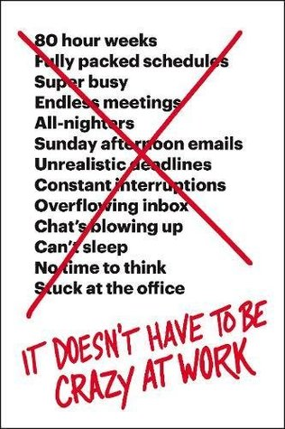

كتاب **It Doesn't Have to Be Crazy at Work** يقلب مفاهيم ومبادئ عالم الشركات الناشئة (خاصة تلك التي تعتمد "الطريقة الأمريكية" منها) رأسًا على عقب. يُعتبر هذا الكتاب امتدادًا طبيعيًا للكتاب السابق الذي نشره نفس الكاتبان Remote: Office Not Required والذي يدور حول مبدأ العمل عن بُعد وفي فِرق مُوزّعة. هذا الكتاب It Doesn't Have to Be Crazy at Work يركّز هذه المرة على مفهوم إدارة الشركات (خاصّة التقنية منها) بكل هدوء وسكينة وبعيدًا عن "الجنون" الذي أصبح مُرادفًا للعمل في أيّة شركة ناشئة.

من بين الأفكار التي ترسّبت لديّ بعد الفراغ من الكتاب:

- أصبح "الجنون" في العمل سمة تتّسم بها العديد من بيئات العمل خاصة في الشّركات الناشئة. المقصود بـ"الجنون" هنا هو وتيرة العمل، الضغّط المُتواصل، الساعات الطوال والجهد المبذول. كل هذه العوامل لا تترك لصاحب الشركة أو للعاملين فيها أي مجال لأية حياة خارج العمل.

- تسرّبت المُصطلحات الحربية إلى بيئة العمل إلى درجة أصبحت ضمن مفردات أية شركة ناشئة. فهذه الشركة ترغب في السيطرة على حصّة الأسد في هذا المجال، وتلك الشركة تهدف إلى سحق المُنافسين، وأخرى تتصيّد أفضل الرؤوس من مُبرمجين ومُسوّقين لتضمّهم إليها.

- شركتك عبارة عن مُنتج في حد ذاته، تمامًا مثلما تعمل على تحسين المُنتج الذي تعمل عليه فإنه يتوجّب عليك أن تعتبر شركتك مجرّد منتج آخر تعمل عليه. المقصود بذلك هو أن الوصول إلى بيئة عمل هادئة سيحتاج إلى عمل وسيحتاج إلى جهد، وتحقيق هذا الهدف قد يتطلّب إحداث تغييرات تدريجية مُتواصلة في بنية الشركة، في طريقة إدارتها، في أهدافها وفي ثقافتها حتى تصل إلى ذلك.

- لا تملك شركة basecamp (التي يملكها ويديرها الكاتبان والتي تُعتبر مصدر إلهام هذا الكتاب) أيّة أهداف. المقصود بذلك بأن الشركة لا تهدف إلى تحقيق نسبة مُعيّنة من الأرباح أو النمو أو المبيعات أو إطلاق عدد مُحدد من المُنتجات أو عقد عدد مُعيّن من الصفقات. كل ما تهدف الشركة إلى تحقيقه هو أن تكون مُربحة وأن توفّر العيش الكريم لأصحابها ولموظّفيها على حد سواء.

- لا حاجة للتخطيط لكل ما ستقوم به شركتك خلال العشرية القادمة أو حتى خلال السنة القادمة. في أغلب الحالات كل ما تحتاجه هو أن تحل المشاكل والعقبات التي تواجهك حينما تواجهك. التخطيط المُستقبلي على الأمد البعيد لن يخدمك أو يخدم أهدافك في توفير بيئة عمل هادئة.

- العمل لمدة 8 ساعات يوميا (40 ساعة أسبوعيًا) كافٍ وزيادة. لا حاجة لأن تحاول العمل لأكثر من ذلك. في أغلب الحالات تجد أن الموظفين في شركات عديدة يحتاجون إلى العمل لساعات أطول بسبب أنه يصعب عليهم التركيز خلال الساعات الثمانية التي يُفترض بهم أن يعملوا خلالها. الأمر راجع بشكل أساسي لصعوبة التركيز في الشركات التي تعتمد "المكاتب المفتوحة" أين تكثر المُلهيات والاجتماعات. لهذا تجد أنه وفي الكثير من الحالات يضطرّ بعض الموظّفين للقدوم باكرًا قبل أن يزدحم المكتب أو البقاء لساعات متأخّرة من الليل وربما حتى إلى القدوم خلال أيام عطل نهاية الأسبوع إن هم أرادوا إتمام الموكلة إليهم.

- تعتمد شركة basecamp مبدأ التواصل اللامتزامن بشكل أساسي. بعبارة أخرى كل سؤال أو نقاش أو موضوع للنقاش يُطرح بشكل يسمح لأي موظف أن يردّ أو يشارك فيه وقتما تفرّغ لذلك. ولهذا تجد أن الشركة تعتمد أحد المبادئ التي نجدها عادة في العالم الأكاديمي والمُتعلّق بمفهوم الـ office hours. فعلى سبيل المثال يخصص كل موظف وقتا مُعيّنا كل أسبوع للإجابة على أية أسئلة قد تكون لدى باقي أعضاء الفريق. هذا الأمر يسمح للجميع باحترام أوقات الآخرين وعدم مقاطعتهم لما يكونون في فترة "العمل العميق". أمر آخر تعتمده الشركة وهو عدم استخدام أية تقاويم مشتركة. فلا يُمكنك أن تحجز على google calendar اجتماعًا مع أي عضو آخر في الفريق بسهولة. بل يجب عليك أن تتواصل معه قبل ذلك. إضافة مثل هذا العائق يقضي على الاجتماعات غير المرغوب فيها، كما يُقلل من المُقاطعات التي تسبب في تراجع مردودية كل مُوظّف.

- الشعارات التي ترفعها العديد من الشركات الناشئة مثل شعار "كلنا عائلة واحدة هنا" هي شعارات فارغة في أفضل الحالات وشعارات مُضرّة في أغلب الحالات. في حين أن أفراد العائلة الواحد يهتم بعضهم لبعض، فإن الشركات عادة ما ستضحي بموظفيها في أول فرصة سانحة. يشير الكاتبان بأنهما في شركتهما لا يحاولان خداع الموظفين بمثل هذه الشعارات ولا يحاولان إيهامهم بأنهم عائلة، بل هم مجموعة زملاء يهتم بعضهم لبعض ويفسحون لهم المجال ليكونوا أعضاء صالحين في عائلاتهم الخاصة.

- وجدت في هذا الكتاب أفضل/أدق تعريف لما يُعرف بثقافة الشركة. المقصود بالثقافة -حسب الكتاب- هو ما يُعتبر طبيعيًا وما يتم القيام به بشكل دائم. فعلى سبيل المثال إن كان الموظفون يتبادلون الطرائف حول رسائل عميل ما أو يصفون عميلًا صعبًا بأسوأ الصفات وبدا لك بأن الأمر "عادي" فاعلم أن مثل هذه التصرفات هي جزء من ثقافة شركتك. إضافة إلى ذلك فإن الرئيس التنفيذي / المدير قد يكون أهم مصدر من مصادر "الثقافة التلقائية" التي لم تُدرس ولم تُتخذ عن قصد. فعلى سبيل المثال إن كنت تريد من الموظفين أن لا يعملوا لأكثر من 8 ساعات يوميا لكنهم يلاحظون بأنك أول الواصلين وآخر المُغادرين فسيتكون لديهم الانطباع بأن ثقافة الشركة تنص على ذلك رغم إصرارك على وجوب عدم العمل لأكثر من 8 ساعات يوميًا.

- يركّز الكتاب على أهمية النوم الجيد ولفترات كافية. أذكر أن تغريدة لـ DHH (أحد الكاتبين) هي التي دفعتني إلى قراءة كتاب "لماذا ننام؟" الذي سبق وأن كتبت مُراجعة حوله تجدها على الرابط التالي:

[https://www.it-scoop.com/2018/07/why-we-sleep-review/](https://www.it-scoop.com/2018/07/why-we-sleep-review/)

- يذكر الكاتب بعض ما يُميّز العمل لدى Basecamp تجعل جميع من يقرأ الكتاب يغبط موظّفيهم. فعلى سبيل المثال لا حاجة للتفاوض على الرواتب لدى الشركة بحكم أنهم يدفعون اعتمادًا على أحسن ما يُدفع مقابل تلك الوظيفة في أكثر الأماكن تنافسية في العالم. كما هو معروف فإن رواتب المُبرمجين في وادي السيليكون هي الأعلى في العالم، وبالتالي يُدفع للمُبرمجين بناء على ذاك أيّا كان المكان الذي يقيمون فيه (هذا على عكس ما تقوم به شركات أخرى مثل Buffer والتي تأخذ المدينة التي يتواجد فيها المُوظّف في الحسبان لما يتم احتساب الراتب). إضافة إلى ذلك فإنه يُدفع لكل موظف تكاليف اشتراكه في نادٍ رياضي (وشراء لباس رياضيِ) إضافة إلى تخصيص مبلغ سنوي للتعلم والتكوين (في أي مجال يرغبه الموظف حتى وإن لم يكن له أية علاقة بالعمل). الإجازة السنوية إجبارية وتدفع الشركة تكاليفها، ويطلب من الموظف الانقطاع بشكل كامل عن العمل (يعني يقوم الموظفون حتى بحذف تطبيق basecamp من هواتفهم لكيلا ينشغلوا بالعمل خلال إجازاتهم) كما يأخذ الموظفون شهرًا إضافيا كل بضعة سنوات للانقطاع والتفرغ الكامل لأنفسهم.

- تعتمد الشركة في الصيف نظام العمل بأسابيع مكوّنة من 4 أيام عمل فقط. أي أن كل موظف يأخذ الجمعة أو الإثنين إلى جانب يومي السبت والأحد الاعتياديين. يشير الكتاب إلى أنهم لم يلحظوا أي تراجع في الأداء بسبب ذلك. كما لا يتم تعقب ساعات العمل، بل يُعامل الجميع على أنهم سيكونون أمينين في عملهم.

- نقطة عالجها الكتاب ولم أكن أتوقع مثلها وهي عدم الحاجة إلى أن تنشد الكمال في كل مهمة تقوم بها. فعلى سبيل المثال يفضل أن تنهي المهمة بأداء جيّد بدل أن تبذل أضعاف الوقت لتنهيها بأداء ممتاز أو قريب من الكمال. فلا يُمانع الكاتبان مثلا أن ينشرا مقالًا أو تدوينة حتى ولو احتوت خطأ إملائيا أو نحويًا، فالأهم هو النوعية والأداء الإجمالي.

- يحذر الكتاب من اعتماد ما يُسمّى بـ "أفضل المُمارسات" best practices والتي تُنشر عادة كقوائم أو مقالات، فما يصلح لشركة كبيرة لا يصلح بالضرورة لشركة صغيرة، وما يفيد شركة ما قد يضر بشركة أخرى.

- ينصح الكتاب بتجنب المخاطر غير المدروسة. يضرب الكتاب مثالًا بالتغيير الحاصل في تسعير تطبيق Basecamp حيث قررت الشركة رفع سعر المُنتج مرّتين (يعني 3 مرات السعر الحالي) بعد إطلاق تحديث جديد للتطبيق. كيف يُمكن اعتبار هذه المُخاطرة مدروسة؟ يشير الكتاب إلى أن الزبائن الحاليين سيحافظون على نفس التسعير وبالتالي فإنه حتى ولو لم ينضم أي زبون جديد بسبب التسعير الجديد فإن مستقبل الشركة ليس مرهونا (بحكم وجود مئات آلاف الزبائن الحاليين). يشير الكتاب إلى أن التسعير الجديد خفض أعداد المُشتركين الجُدد إلا أن ذلك لم يؤثر على أرباح الشركة بحكم ارتفاع التسعير الذي يدفعه المشتركون الجُدد.

- أجمل فكرة في الكتاب -في رأيي- هي القناعة. المقصود بذلك هو أنه وبعد أن تصل الشركة إلى مستوى مُعيّن من الربحية ويحصّل أصحابها على مستوى مُعيّن من الثروة فلا حاجة فعلية للمزيد. بعبارة أخرى لا حاجة للسعي وراء النمو المتواصل والمتزايد. صحيح بأن الشركة ستنمو لكن ستنمو ببطء. هذا ما يخلق جوًا من السكينة في الشركة يعود بالنفع على الجميع.

أنصح الجميع بقراءة هذا الكتاب، حتى إن لم تكن تنوي إطلاق شركة الخاصة فقد تُساعدك أفكار هذا الكتاب في تحسين أوضاع الشركة التي تعمل الآن لصالحها. الكتاب قصير نسبيًا ويُمكنك إنهاؤه في جلسة واحدة (حوالي ساعتين). إن كنت ممن يفضّلون الكتب الصوتية فأداء هذا الكتاب كانت في القمّة.
