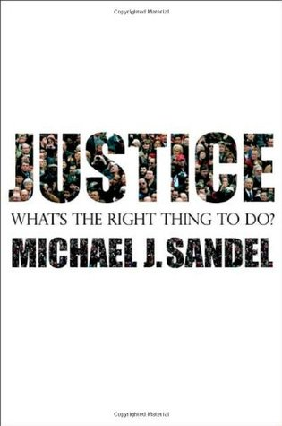

كتاب عظيم. هذا ما دار في ذهني اللحظة التي أنهيت الكتاب فيها. كتاب عظيم بكل ما تحمله الكلمة من معنى، وأحسست بنوع من الندم لأنني حصلت على نسخة من هذا الكتاب منذ سنوات عديدة ولم تتسن لي قراءته سوى مؤّخرًا.

هناك مقولة طالما كان أستاذ الفلسفة في الثانوية يردّدها "طرح السؤال أهم من الوصول إلى إجابة". للأسف لم أكن أعِ معنى هذه العبارة حينها، ولم أفهمها جيّدًا إلا سنوات عديدة بعد ذلك. هذا الكتاب جعلني أحسّ بلذّة "طرح السؤال أهم من الوصول إلى الإجابة" من جديد وبقوّة ربما يندر أن أجد لها مثيلًا في كتب غيرها.

الكاتب Michael J. Sandel يتحدث في كتاب Justice: What's the Right Thing to Do عن مفهوم العدالة Justice ويُمكن اعتباره مدخلًا ممتازًا للفلسفة السياسية بشكل عام. المقصود بالعدالة هنا هو كيف يجب علينا أن نتصرف، على أيّة قاعدة يجب أن تُبنى قرارتنا كأفراد أو كمجتمعات أو حتى كدول. يستعرض الكاتب 3 توجّهات في هذا المجال، يتعلّق الأول بـ"مذهب المنفعة" utilitarianism والذي ينص على أنه يتوجّب علينا دائما القيام بما يحقق أكبر منفعة مُمكنة لأكبر عدد من الناس، "الفلسفة التحررية" libertarianism والتي تنص على أن الأصل هو توفير الحرية المُطلقة لكل واحد فينا، وأن جميع قراراتنا يجب أن تكون مبنية على ذلك، ومذهب ثالث (وهو المذهب الذي يتبناه صاحب الكتاب) والذي ينصّ على أن العدالة يجب أن تعتمد على ما نعتبره فضيلة virtue وأن نأخذ دائما في الحسبان ما يُطلق عليه "الصالح العام" Common good .

التالي ليس تلخيصًا للكتاب، بل مجرد نظرة سريعة وخاطفة حول بعض الأفكار الهامة التي ترسّبت لدي بعد الفراغ من الكتاب. بعبارة أخرى، أعي جيّدا بأن النقاط التالية لا تمثّل سوى جزء صغير من الأفكار الواردة في الكتاب (كما أنها لمحة سريعة لا تعطي الكتاب كامل حقّه):

- يُعتبر الفيلسوف الإنجليزي جيريمي بينثام الأب الروحي لفلسفة المنفعة والتي تنص على أن كل البشر ينشدون اللذة وينفرون من الألم، وعليه فإن ما يُعتبر أخلاقيًا أو عادلًا -حسب هذه النظرة- هو ما يُحقق السعادة (اللذة) لأكبر قدر من الناس وما يجنّبهم الألم (والشقاء).

- الفلسفة التحررية تقوم على أساس أن الحرية هي أغلى ما يملكه الإنسان (الإنسان ملك لنفسه فقط) وأن قراراتنا يجب أن تُبنى حول هذا المفهوم. أي ما يُمكن اعتباره أخلاقيا/عادلًا هو ما يضمن هذه الحرية وأي ما يُقيّد هذه الحريّة هو عمل غير مُنصف وغير عادل.

- استعرض الكاتب بنوع من التفصيل فلسفة كانط والتي تدور حول فكرة أساسية تنص على أن الهدف/النّية/القصد هو الذي يُحدّد ما إذا كان ما نقوم به عادلًا/أخلاقيًا أو لا. فعلى سبيل المثال لو دخل إلى بقالتك طفل صغير وكان بإمكانك استغلال جهله بالأسعار لبيعه رغيف خبز بسعر مُرتفع، وإن كان عدم قيامك بذلك راجع بشكل أساسي إلى خوفك من اكتشاف أمرك واكتسابك لسمعة سيئة فهذا العمل لا يُعتبر أخلاقيًا. في حين لو أنّك عاملت هذا الطفل الصغير بعدل لأنك تعتقد بأن هذا ما يجب القيام به فإنّك بهذا الأمر تكون أخلاقيًا/عادلًا.

- حسب التعريف السابق فإننا نستنتج بأن كانط يُعارض فلسفة المنفعة جملة وتفصيلًا، لأن كل عمل -حسب هذه الفلسفة- يُقاس بمقياس النتائج، وحسب كانط فإن النوايا/الأهداف هي ما يجعل من العمل أخلاقيًا/عادلًا من عدمه.

- تنص فلسفة كانط أيضًا على أن ما يجب علينا القيام به هو ما يتوافق مع الضرورات الحتمية categorical imperative والمقصود بذلك هي تلك الأمور التي تعتقد بأنه يجب على الجميع القيام بها. بعبارة أخرى لو تساءلت "هل يُمكن أن أقطع وعدًا تعلم بأنك لن تفي به" فإنه لو قام الجميع بذلك فهل ترى بأن هذا الأمر عادل/أخلاقي؟ تجدر الإشارة هنا إلا أنه -حسب هذه النظرة- لا يجب أن ترفض الفكرة السابقة لأنه لن يثق فيك أي أحد من جديد لو ألِفت قطع وعود لا تفي بها، فهذا سيضعك في خانة الفلسفة النفعية آنفة الذكر (تفعل شيئًا أو تتجنبه للحصول/لتجنب أمر آخر).

- الفيلسوف الأمريكي جون راولز لديه رأيه مختلف حول ما يُمكن اعتباره عادلًا من الناحية الاجتماعية (العدالة الاجتماعية)، حيث يرى بأنه لا يُمكن أن نعرف ما هو عادل دون أن ننطلق من مبادئ مساواة من خلف "ستار جهل" veil of ignorance. المقصود من ذلك يُمكن أن يتوضّح من خلال المثال التالي: لنفرض أننا نحاول تقرير ما إذا كانت الطبقية أو التمييز العنصري عادلًا. للقيام بذلك يجب أن نفترض بأننا نجهل كل شيء عن ما يميزنا عن غيرنا (الجنس، العرق، لون البشرة، السن، الجنسية…) ونطرح هذا السؤال من جديد. بحكم أننا خلف ستار الجهل هذا لا يُمكن لنا أن نعرف إن كنا سنقع على الجانب الإيجابي من أية قضية اجتماعية نرغب في دراستها (لا تعرف مثلا إن كنت ستصبح زنجيا حمله سيّده الأبيض ليعمل في حقوله الزراعية). بعد توفّر هذه الوضعية الافتراضية الابتدائية، حينها يُمكن لنا أن نقرر ما يُعتبر عادلًا من الناحية الاجتماعية من عدمه، لأن أيّة امتيازات أو أعباء اجتماعية نملكها حاليًا لن تسمح لنا بالتفكير بشكل واضح في القضايا التي نقررها مدى عدالتها.

- أما أرسطو فله رأي مُختلف نسبيًا حول العدالة. فحسب أرسطو قبل أن نتساءل عن عدالة أية قضية فيجب أن نفهم أولًا هدف تلك القضية. ضرب الكاتب مثالًا بلاعب جولف مُحترف يعاني من مشاكل صحيّة تجعل من مهمة السير في حقول الجولف على قدميه مهمّة صعبة. هل يُمكن اعتبار السماح لهذا اللاعب باستخدام عربة تنقل أمرًا عادلًا في حقه وفي حق باقي اللاعبين؟. حسب أرسطو يجب علينا أن نتساءل عن ماهية/جوهر Telos اللعبة أولًا. فلا يُمكن أن نحدد عدالة أمر ما دون فهم عميق لجوهره أولًا والهدف من وجوده.

- قد تتساءل وما الذي يعنيني من كل هذه الفلسفات. يكفيني أن أقرر بأن فلسفة ما هي الأصوب (وربما الفلسفة التي تبني عليها فكرك حاليًا). يبدو لي بأن معالجة نفس الفكرة من زوايا مُختلفة يسمح لنا بفهم عميق لتلك الفكرة، وربما حتى معرفة نقاط القوة والضعف (حتى في الآراء التي نحملها) بشكل أفضل. الهدف ليس بالضرورة تغيير رأيك أو اعتبار بعض الأفكار خاطئة، بل الهدف بشكل أساسي هو تقوية الملكة الفكرية لديك وشحذ مبادئ العدالة والحق لديك عبر تعريضها إلى مُختلف الآراء والتوجّهات الفكرية (ومن هذا اللذة آنفة الذكر المُتعلقة بطرح الأسئلة).

تجدر الإشارة إلى أن هذا الكتاب مُستوحى من محاضرات الكاتب في جامعة هارفارد حول نفس الموضوع. سبق تسجيل هذه المحاضرات ونشرها على يوتيوب ويُمكن مشاهدتها من خلال هذا الرابط:

[https://www.youtube.com/view_play_list?p=30C13C91CFFEFEA6](https://www.youtube.com/view_play_list?p=30C13C91CFFEFEA6)

- الكتاب من نوعية الكُتب التي يجب أن تقرأ أكثر من مرّة. لمايكل صاندل (المؤلف) كتاب آخر هو امتداد لبعض أفكار هذا الكتاب What Money Can't Buy: The Moral Limits of Markets سبق وأن كتبت لمحة سريعة حول هنا:

[https://www.it-scoop.com/2018/06/what-money-cant-buy/](https://www.it-scoop.com/2018/06/what-money-cant-buy/)
