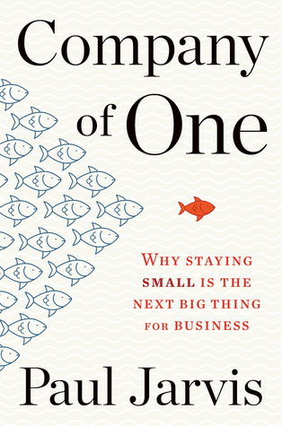

بعد أن كان شعار "النمو مهما كان الثمن" الشعار الذي ترفعه الشركات خاصّة التقنية منها خلال السنوات الماضية، بدأت تظهر على السّاحة أصوات مُخالفة لهذا التّوجّه، قد يكون أحد أهم الناقدين لفكرة النمو الدائم (من جديد على الساحة التقنية بشكل أساسي) ديفيد هينماير هانسون (المعروف اختصارًا بـ DHH) أحد مؤسسي شركة Basecamp ومطور إطار عمل Ruby on Rails. إن سبق لك قراءة أيا من كُتب DHH خاصة أحدث كتاب له [It Doesn’t Have to Be Crazy at Work](https://www.it-scoop.com/2018/10/it-doesnt-have-to-be-crazy-at-work-review/) فقد تكون على علم بكيفية إدارته لشركته بشكل يسمح لها بالبقاء مُربحة دون الحاجة إلى النمو المتواصل. DHH يتحدث عن تجربته بعد أن وصل بشركته إلى العالمية، لكن إن كنت تتساءل "كيف أبدأ من الصفر" فستجد ضالتك في الكتاب الذي نحن بصدد الحديث عنه.

مفهوم **Company Of One** (**شركة الفرد الواحد**) لا يعني بالضرورة أن تكون الموظف الوحيد في شركتك أو أن تعمل وحيدًا أو حتى أن تعمل كُمستقلّ، لكن يعني بشكل أساسي أن تبني شركة تدور حول حياتك وليس العكس وأن تكون جميع قراراتك المُتعلّقة بشركتك تهدف إلى توفير حياة كريمة لك وفق نظام أن تقرره لنفسك دون السعي الحثيث وراء النمو المُتزايد بشكل مُتواصل.

بعبارة أخرى، شركة الفرد الواحد هي شركة صغيرة الحجم عن قصد تهدف إلى توفير دخل دائم لصاحبها إلى جانب توفير قدر كبير من الحرّيّة وتوازن جيّد ما بين الحياة والعمل Work-life Balance.

يُمكن القول بأن مفهوم شركة الفرد الواحد تتعارض بشكل صارخ مع ثقافة الشركات الناشئة على الطريقة الأمريكية والتي -للأسف- يُحاول الكثيرون استنساخها، حيث أن ثقافة الشركات الناشئة تعتمد على النّمو بشكل دائم وسريع في حين أن ثقافة شركة الفرد الواحد تدور حول مفهوم "إطلاق شركة توفّر لي ما فيه الكفاية"، شركة تستطيع الصمود في وجه التغيرات المُفاجئة في السوق لأنها صغيرة بما فيه الكفاية.

الكتاب مليء بالأمثلة عن شركات قررت البقاء صغيرة رغم تحقيقها نجاحًا كبيرًا، كما أنه يركّز على ما يجب القيام به لتتمكن من إنشاء شركة فرد واحد بنجاح.

من بين الأمثلة التي ستذكرها -لا محالة- بعد الفراغ من الكتاب، فندق Nishiyama Onsen Keiunkan في مُقاطعة ياماناشي اليابانية والذي يُعتبر الفندق الأقدم في العالم الذي لا يزال في الخدمة والذي فتح أبوابه لأول مرة سنة 705 ميلادية ولا تزال تُديره نفس العائلة إلى غاية اليوم (52 جيلا متواصلا). الفندق لا يحتوي سوى 35 غرفة إضافة إلى 6 مسابح للماء الساخن الطبيعي. بالرغم من أن هذا الفندق يُعتبر الأقدم الذي لا تزال أبوابه مفتوحة إلا أنه لم يحاول أن يُصبح سلسلة فنادق أو أن يزيد عدد غرفه أو خدماته، بل بقي صغيرًا عن قصد وهذا القرار هو ما سمح لـ 52 جيل متواصل من نفس العائلة أن تُحافظ وتتربّح من هذا المشروع. الفندق يركّز على تقديم خدمات أفضل وليس خدمة أكبر عدد مُمكن من الزبائن.

في المُقابل هناك شركة Kongō Gumi اليابانية والتي تُعتبر أقدم الشركات وأطولها عمرًا على الإطلاق والتي تتخصّص في بناء المعابد البوذية. انطلاقة هذه الشركة كانت سنة 578 ميلادية وواصلت نشاطها في هذا المجال فقط، إلى غاية ثمانينيات القرن الماضي، حيث قررت إدارة هذه الشركة حينها أن تدخل مجال التنمية العقارية لتأخذ حصتها من نمو سوق العقار في اليابان في تلك الفترة ولتحقق نموًا كبيرًا، وهو ما حصل بالفعل، إلا أن فقاعة سوق العقار في اليابان ما لبثت أن انفجرت واضطرت الشّركة حينها أن تبيع نفسها لشركة أخرى أكبر بسبب الديون التي تراكمت لديها. 1428 سنة من النشاط المُتواصل لما كانت الشركة صغيرة أصبحت جزءًا من الماضي بسبب السعي وراء النّمو.

لكن المثال الذي لفت انتباهي كثيرًا هو صديق للكاتب والذي أخبره لما كان يقضي بعض الوقت معه في أحد أيام الصيف بأنه لن يحتاج أن يعمل إلى غاية بداية السّنة القادمة، لأنه منذ بداية العام إلى شهر أغسطس الذي كانا فيه استطاع أن يُحقق من الأرباح ما يكفيه لتغطية جميع نفقاته طيلة العام. قد يبدو الأمر غريبًا في نظر الكثيرين، لكن نظرة الكاتب وصديقه هذا تدور حول مفهوم "الكفاية" enough وبحكم أنه يعلم ما الذي يحتاجه من مداخيل ليعيش حياة كريمة طيلة عام كامل فإنه يكتفي بتحقيق هذا الهدف ومن ثم الاستمتاع بحياته فيما تبقى من العام.

يتحدّث الكاتب في آخر فصل في الكتاب عن تجربته الشخصية في إطلاق شركة الفرد الواحد الخاصة به، وكيف أنه تعثّر في بداياته قبل أن تستقيم الأمور من جديد ويُوفّق في الأمر. يبدو لي بأن هذا الفصل إضافة إلى الفصل الأول هما أفضل ما في الكتاب، حيث أن مُحتوى باقي الكتاب قد يكون معروفًا لديك خاصة إن سبق لك وأن قرأت كتاب DHH آنف الذكر.

على الجانب، هناك فكرة أراها غريبة في الكتاب، والتي بدت لي وكأنها أضيفت بعد أن تبلورت فكرة الكتاب كاملة، حيث أنها لا تبدو مُتناسقة لا مع مُصطلح "شركة الفرد الواحد" ولا مع التعريف الخاص بها ويتعلق الأمر بمفهوم "شركة الفرد الواحد" ضمن شركة أخرى أكبر. بعبارة أخرى وكأن الكاتب أراد أن يضم الأشخاص الذين لا يبحثون عن إطلاق شركاتهم في نفس الفكرة، لكن في رأيي هذا الدّمج لم يكن مُوفّقًا.

الكتاب مُفيد جدًا وأراه امتدادًا جيّدا لكتاب It Doesn’t Have to Be Crazy at Work وأنصح جميع من يرغب في إطلاق شركة خاصة به بقراءته خاصّة إذا كُنت تعمل كمُستقل حاليًا وترغب في إضفاء المزيد من الاحترافية على نشاطك التجاري.

الكتاب متوفّر على Audible أيضًا وبصوت الكاتب نفسه.
