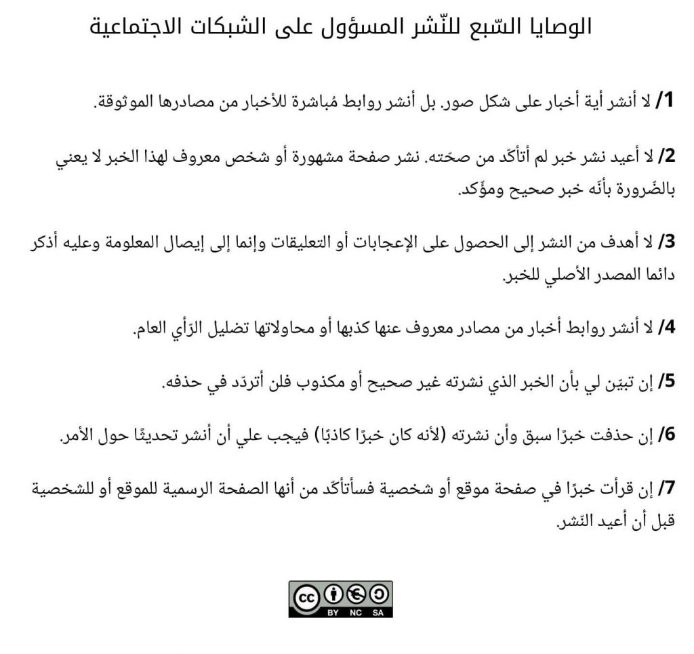

بحكم الانتشار المُتزايد للأخبار الكاذبة/المُضلّلة التي تُنشر عن قصد أو عن غير قصد على الشّبكات الاجتماعية، حاولت جمع هذه القواعد السريعة والتي يُمكن لها الحدّ أو على الأقل التقليل من كميّة الأخبار الكاذبة والمُضلّلة التي تهدف بشكل أساسي إلى تغليط الرأي العام (خاصّة في المجال السياسي).

**الوصايا السّبع للنّشر المسؤول على الشبكات الاجتماعية**

1/ لا أنشر أية أخبار على شكل صور. بل أنشر روابط مُباشرة للأخبار من مصادرها الموثوقة.

2/ لا أعيد نشر خبر لم أتأكّد من صحّته. نشر صفحة مشهورة أو شخص معروف لهذا الخبر لا يعني بالضّرورة بأنّه خبر صحيح ومؤّكد.

3/ لا أهدف من النشر إلى الحصول على الإعجابات أو التعليقات وإنما إلى إيصال المعلومة وعليه أذكر دائما المصدر الأصلي للخبر.

4/ لا أنشر روابط أخبار من مصادر معروف عنها كذبها أو محاولاتها تضليل الرّأي العام.

5/ إن تبيّن لي بأن الخبر الذي نشرته غير صحيح أو مكذوب فلن أتردّد في حذفه.

6/ إن حذفت خبرًا سبق وأن نشرته (لأنه كان خبرًا كاذبًا) فيجب علي أن أنشر تحديثًا حول الأمر.

7/ إن قرأت خبرًا في صفحة موقع أو شخصية فسأتأكّد من أنها الصفحة الرسمية للموقع أو للشخصية قبل أن أعيد النّشر.

ارتأيت أن أحوّلها إلى صورة لأنها أسهل للنشر على الشبكات الاجتماعية (رغم أن ذلك قد يُخالف بشكل مُباشر القاعدة الأولى في القائمة)

إن كنت مُصمّما ولديك الرّغبة في تحويلها إلى إنفوجرافيك فلا تتردّد في ذلك.

 

هذه مُجرّد قواعد خطرت على بالي، إن كانت لديك قواعد أخرى إضافية (أو أفضل) فلا تتردّد في مُشاركتها هنا كتعليق
