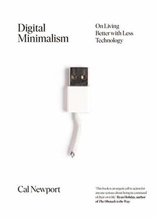

هل تحُس بأنّك تُضيّع الكثير من الوقت والجهد على الشبكات الاجتماعية أو ربما تشعر بالخوف من تضييع أحداث مُهمّة بسبب انقطاعك ولو لبعض الوقت عن هذه الشبكة الاجتماعية أو تلك؟ هل ترغب في التخلص كلّية من فيس بوك وتويتر وإنستاجرام لكن لا تدري ما السّبيل إلى ذلك؟ هذا الكتاب يُحاول الإجابة على هذه الأسئلة وأسئلة أخرى.

الكتاب يقوم على فكرة أن التقنيات الحديثة (وخاصة الشبكات الاجتماعية) ليست سيّئة بالضّرورة (رغم أن مُحتوى الكتاب يُشير إلى عكس ذلك)، لكّنها حُسّنت وطُوّرت بشكل يجعلك تُدمن عليها لتبقى أطول فترة مُمكنة عليها. كما أنه يركّز على فكرة أن تجعل التقنية/ الشبكات الاجتماعية وسيلة في يدك تتحكّم فيها أنت لتخدمك وليس وسيلة تتحكّم فيك لتخدمها أنت.

قد يكون أفضل مثال ضربه الكاتب لتوضيح هذه الفكرة هو طائفة الآميش النصرانية والتي عادت ما يتم الحديث عنها (خاصّة في الإعلام) على أنّها طائفة مُعارضة للتكنولوجيا وللتقدّم وأنها تعيش خارج الحضارة. يُشير الكاتب إلى أن العكس ما يحدث مع هذه الطائفة، حيث أنه ومع ظهور أي تقنية حديثة إلّا ويقوم بعض أعضاء هذه الطائفة بالحصول على تصريح من رجال دين الطائفة لتجربتها ومعرفة فوائدها، ومن ثم يتم استخدامها أو اعتمادها ولو جزئيا إن كانت تلك التقنية تخدم المبادئ/الأهداف الأساسية للطائفة خاصّة ما تعلّق منها بالجانب الاجتماعي. بعبارة أخرى، أعضاء هذه الطائفة يستخدمون التقنيات الحديثة فقط فيما يخدم أهدافهم ويُحقق مبادئهم التي يعيشون وفقها ويرفضون أي تقنية قد تتعارض مع ذلك.
فتجدهم مثلا لا يُعارضون استخدام الكهرباء مادام يقوم الأفراد بتوليدها بأنفسهم (مما يحصر استخدامها فقط فيما هو مفيد ومهم)، كما أنهم يمنعون امتلاك السّيارات لأن السيارات الفردية ستُمكّن أصحابها من زيارة أماكن بعيدة للترفيه وهو ما سيحول بينهم وبين زيارة الأقارب والأصدقاء في مجتمعاتهم، لكن رغم ذلك لا يمانعون السفر باستخدام السيارات في حالات أخرى.

بعبارة أخرى، ما يرغب الكتاب في إيصاله هو: حدّد أهدافك وأولوياتك أولا ثم ابن استخدامك للتقنية وللشبكات الاجتماعية وفق ما يخدم تلك الأهداف ويتوافق مع تلك الأولويات.
على سبيل المثال لا الحصر، لو كنت ترغب في البقاء على اطّلاع على الأحداث السياسية في بلدك (أي أن هذا هو هدفك الرئيسي) فهل تعتقد فعلا أن إمضاء 5 ساعات يوميا على فيس بوك هو الحل الأمثل لذلك؟ لو فكّرت قليلًا لوجدت أن شراء جريدة أو جريدتين يوميا (ربما من تيّارين مُختلفين) أو الاشتراك في بعض القوائم البريدية أو ربما حتى متابعة بعض الصّحفيين الأكفاء على تويتر سيجعلك أكثر اطّلاعًا بأشواط كثيرة.

يشير الكتاب إلى أن الشبكات الاجتماعية التي تستهلك الكثير من الوقت والجهد حاليًا لم تُكن على هذا النّحو لما تم إطلاقها أوّل مرّة، لكن ومع مرور الوقت وربما بسبب ضغوط المُستثمرين للحصول على العائد الكبير الذي وُعدوا به، فإن هذه الشبكات الاجتماعية وجدت طرقا لتجعل تُدمن (بكل كل ما تحمله الكلمة من معنى) على استخدامها لتبقى أطول مُدّة ممكنة عليها (تذكّر دائمًا أنه لما لا تدفع مقابل ما تستخدمه على الإنترنت فمن المُرجّح جدًا أنّك السّلعة التي يتم بيعها).
كما يُذكّر الكتاب بسبب إدماننا على الشبكات الاجتماعية وبيّن بأنه إدمان حقيقي يُقارن بالإدمان على القمار مثلًا، فبحكم أن المُقامر لا يدري إن كان سيربح أو يخسر في المرة القادمة التي يلعب فيها مما يولّد إليه تلك "الحاجة النفسية" لتكرار اللعب فإن نفس الأمر يحدث على الشبكات الاجتماعية، فتجد نفسك تُحدّث الصفحة لترى إن كان هناك أي جديد رغم أنه لم تمض سوى دقائق معدودات على آخر مرّة قمت بذلك.

الكتاب ينصح بالتّخلّص من جميع الشبكات الاجتماعية وجميع خدمات التواصل (بما فيها البريد الإلكتروني إن كنت لا تعتمد عليه بشكل مُباشر في حياتك العملية) لمدّة شهر كامل ومن ثم إعادة إرجاع الخدمات الضرورية فقط ومُحاولة الحد من استخدامها.
على سبيل المثال وبعد أن تتخلّص من الإدمان بعد إيقافك لفيس بوك لشهر كامل، وبعد أن ترجع إليه خصّص وقتا مُحدّدا في نهاية الأسبوع على حاسوبك (وليس على هاتفك) للبقاء على اطّلاع على ما يهمّك من أخبار الأصدقاء والأقارب. يمكنك أيضًا التخلص من تطبيقات الدردشة وإيجاد بدائل لها. فبدل أن تتواصل مع أقاربك وأصدقائك عبر خدمات الدردشة التي عادة ما تتطلب حضورًا دائمًا، فإنه يمكنك استبدالها عبر البريد الإلكتروني، التواصل عبر الهاتف أو حتى المقابلات وجها لوجه.

أورد الكتاب قصص قرّاء كُثر تفاعلوا مع قائمة الكاتب البريدية وشاركوا في هذه التجربة، حيث أحسّ الكثيرون منهم رغبة أقل في الرجوع إلى فيس بوك مثلًا بعد انقضاء هذا الشّهر، بل وقللوا استخدامهم له من استخدام يومي إلى استخدام أسبوعي لدقائق فقط.
ما لفت انتباهي هو أنه وكلما كانت وظيفة بعض من تمّت مُحاورتهم في الكتاب قريبة من أو تعتمد بشكل كبر على الشبكات الاجتماعية إلّا ووجدت أن صاحبها يستخدم تلك الشّبكات بحذر ولا يفرط في استخدامها.

أعجبتني أيضًا تلك الأمثلة التي قد تبدو مُخالفة للمألوف، فتجد مثلًا أن بعض المُضاربين في سوق الأسهم والذين يُعتقد بأنهم في أمس الحاجة على البقاء على اطلاع بكل شاردة وواردة يتخلّصون من هواتفهم الذكّية بشكل كامل ويستبدلونها بهواتف "عادية" لا تسمح سوى باستقبال وإجراء مُكالمات هاتفية. كما أعجبتني أمثلة بعض الأولياء الذين تلخصوا من هواتفهم الذّكيّة أو حددوا أماكن خاصة يُمكنهم استخدام هواتفهم فيها داخل المنزل حتى يكونوا قدوات لأولادهم، فلا يُمكن أن تأمر أولادك بترك ما تراه سيّئا لو كنت أول من يقوم بالأمر.

من بين الأفكار المُهمّة التي أوردها الكتاب فكرة "العزلة" والتي تختلف عن فكرة "الوحدة" (أو أن تكون لوحدك)، حيث عرّفها على أنها انقطاع الفرد عن أية أفكار أو مُدخلات من جهات خارجية. بعبارة أخرى، العزلة -حسب الكاتب- هي أن تكون مع أفكارك فقط وتنقطع عن كامل العالم الخارجي. حسب الكاتب أصبحنا في وقت يصعب فيه الحصول على العزلة ولو لأوقات قصيرة، فحتى لما تكون بمفردك وحيدًا فإن عادة ما ترافقك الشبكات الاجتماعية أو صفحات الإنترنت أو ربما حتى الموسيقى أو البودكاست أو إلى الكتب الصوتية. كما ضرب أمثلة بشخصيات عديدة عُرفت بممارستها لهذا النّوع من العزلة والفوائد التي نتجت عن ذلك.

الكتاب في غاية الأهمّية خاصّة لمن أراد التخفيف من وطأة استخدامه لهذه التقنيات الحديثة والشبكات الاجتماعية. سيدفعك الكتاب إلى إعادة التفكير من جديد في كل هذه التقنيات وقد تجد نفسك قد تخلّصت من الخدمات التي لا تقدّم لك أي نفع حتى قبل فراغك من الكتاب.
