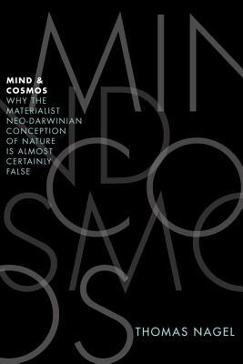

كتاب صغير الحجم لكنه صعب المِراس بحكم طابعه الفلسفي البحت. كاتبه هو الفيلسوف والبروفيسور الأمريكي توماس نايجل Thomas Nagel المُلحِد. ما الحاجة إلى ذكر مُعتقد الكاتب هنا؟ فقط لتبين بأن فكرة الكتاب لا تقوم على أي أساس ديني.

قبل أن أخوض في تفاصيل الكتاب، أودّ أن أشير (وأذكّر) بأن ما قد تقرأه هنا قد لا يكون دقيقًا بالضرورة (لا أضمن بأنني فهمت الكتاب بشكل جيّد بحكم صعوبة وتعقيد الموضوع المُعالج).

الفكرة الأساسية للكتاب هي أنه يمكن الجزم (أو لأكون دقيقًا، يُمكن لنا أن نكون واثقين إلى حد كبير) بأن نظرية التطور والتي تقوم على أساس مادي بحت هي نظريّة خاطئة (أو ليست بالضرورة دقيقة أو كاملة)، من حيث أنها تغفل على أية جوانب لا يُمكن الاستدلال عنها خارج النطاق المادي للعالم الذي نعيش فيه.
حسب الكاتب فإن الجانب المادي لنظرية التطوّر لا يُمكنه بأي حال من الأحوال تفسير نشوء العقل والوعي، حيث أنهما ليسا مُجرد تحصيل حاصل لهذا العالم المادي الذي نحن فيه، بل وجود العقل والوعي هو جزء أساسي ومهم وركيزة من ركائز الطبيعية المُحيطة بنا يحتاج إلى تفسيرٍ لنشوئه، حيث أنه لا يُمكن أن يُعتبر مجرد "نتيجة" أو "حادث عرضي" للجانب المادي المُتمثّل في مجرد تفاعلات كيميائية وخضوع لقوانين الفيزياء.

يشير الكاتب إلى أن الكون الذي نحن فيه يملك غاية في حد ذاته (مبدأ الغائية teleology) وأنه من بين ما يُمكنه إثبات أن نشوء العقل والوعي ليس مجرد نتيجة للعالم المادي هو أن هذا الكون قابل للفهم، أي أنه بإمكاننا أن نفهم قوانينه ومبادئ عمله، كما أن العلم الحديث كله يقوم على أساس أنه يمكنك فهم قوانين الطبيعة واستنباطها والبناء على تلك النتائج.

الكاتب لا يقترح تصوّرا بديلًا لكيفية نشوء الحياة، فهو لا يرى بالضرورة أن النظرة الدينية (وجود خالق خلق المخلوقات كما هي عليه الآن) أو حتى التصميم الذّكي هما البديلان لنظرية التطّور الحديثة. لكنه يشير إلى أن هدفه هو لفت النظر إلى قصور هذه النظرية والتي قد تكون جانبًا فقط من الصورة الكاملة أو ربما لا تكون جزءًا منها إطلاقًا. يشير الكاتب إلى أنه لإيجاد تصوّر بديل، فيجب على الأقل الإقرار بقصور التصوّر الحالي والتفكير في إمكانية وجود بدائل له.

اكتشفت هذا الكتاب لدى قراءتي لكتاب آخر: The Human Instinct (والذي يُمكنك أن تقرأ "مُراجعتي" له هنا:[ https://www.it-scoop.com/2018/12/the-human-instinct-book-review/](https://www.it-scoop.com/2018/12/the-human-instinct-book-review/)) حيث أن الكاتب Kenneth R. Miller في كتابه هذا كان يردّ على بعض ما ورد في كتاب Mind and Cosmos في العديد من فصوله (بالمناسبة، قد ترغب في قراءة الكتابين معًا).
المفارقة العجيبة فيما يخص هاذين الكتابين هو أن توماس نايجل (صاحب كتاب Mind and Cosmos) هو مُلحد، في حين أن Miller الذي يُدافع على نظرية التطوّر في كتابه هو مسيحي مؤمن.

الكتاب مُهمّ من حيث أنّه يدفعك إلى التفكير رغم أنه لا يقدّم لك حلولًا وبدائل جاهزة.
