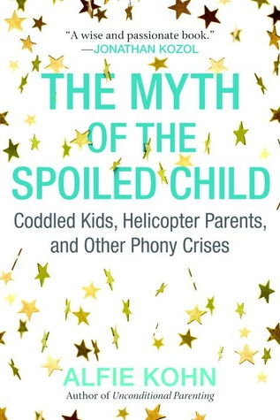

كتاب يهدف بشكل أساسي إلى نشر فكرة أن الطريقة التي نربّي بها أطفالنا تعتمد على أفكار ومبادئ خاطئة(محافظة بشكل أساسي) بأن الاعتقاد السائد بأن الأطفال والشباب في الوقت الراهن هم أسوأ أطفال/شباب عرفهم التّاريخ، بأنّهم يحصلون على كل ما يرغبون فيه وبأن أوليائهم مُتساهلون معهم من جهة ويفرطون في حمايتهم من جهة أخرى.

صراحة لم أستطع أن أكوّن رأيًا واحدًا وواضحًا حول هذا الكتاب. فمن جهة يُعارض كل ما هو متعارف عليه فيما يخص مجال التربية، مثل تعامل الأولياء مع نوع من الصرامة مع أولادهم أو دفعهم إلى القيام بأمور لا يوافق عليها الطفل في الكثير من الأحيان وحتى كون الأطفال (وحتى الشباب) يعتمدون بشكل كبير على أوليائهم والحماية المفرطة للأولياء لأولادهم. لكنه من جهة أخرى يبيّن أن الكثير من الدراسات والحجج التي يعتمد عليها أصحاب "الطريقة التقليدية" في التربية ليس دراسات قويّة (من حيث المنهج)، دراسات تم تفسير نتائجها بشكل غير دقيق، أو دراسات كانت نتائجها في واد والأخبار/المقالات/النتائج التي نتجت عنها في واد آخر، وخصّ بالذّكر تجربة المرشميلو والتي يُستشهد بها عادة على أن الطفل الذي يملك تحكما في الذّات أقوى ينتهي به المطاف بعد سنوات أنجح من غيره، في حين أن نتائج الدراسة الفعلية (أو على الأقل هذا ما يُشير الكاتب إليه، بحكم أنني لم يتسن لي مُراجعة تلك الدراسة بنفسي) تركّز بشكل أساسي على البيئة التي تمّت فيها التجربة، حيث أن الطفل الذي وجد طريقة لإلهاء نفسه خلال التجربة هو الطفل الذي استطاع أن "يصبر" لمدّة أطول ولا علاقة للأمر -حسب الكاتب- بقوّة التّحكّم في الذّات.

بعبارة أخرى، قد يكون الكاتب قد وجد فعلًا خطأ في ما هو مُتعارف عليه على أنه الطريقة الأنسب لتربية الأطفال، لكنّه لا يكون قدّم حلولًا مقنعة أو بدائل عملية بالضّرورة.

لفت انتباهي أن الكاتب يفضّل الدّوافع الداخلية على الدوافع الخارجية، من حيث أنه يفضّل أن يقوم الطفل بالأمر بدافع داخلي وليس لأن وليّه فرض الأمر عليه، لكن ما وجدتّه غريبًا هو إلحاح الكاتب أن ليس كل ما ينبع من الداخل هو صحّي، حيث يمكن أن يستوعب مجموعة من القواعد ويمشي عليها وتصبح نابعة من داخله، لكن حسب الكاتب مثل هذه القواعد هي بنفس سوء القواعد المفروضة من الخارج، حيث يرى بأن الطفل وكأنه تعرّض إلى نوع من البرمجة دفعته إلى اكتساب هذه القواعد والتي قد لا تتوافق مع ما قد يرغب الطفل في القيام به بالضّرورة. وهنا أجدني أتساءل، أليس هدف التربية الأساسي هو بالفعل جعل الطفل يملك ذلك الدافع والرقابة الداخلية؟

نقطة أخرى مهمة (وقد تكون الأهم في نظري) في الكتاب وهو ما يسميه الكاتب "العمل مع الطفل" بدل "العمل عليه" (أو ما شابه)، من حيث أن التربية يجب أن يُشرك فيها الطفل ولا يجب أن يتلقّاها تلقّيًّا.

الكتاب مُهمّ من حيث أنه يدفعك إلى إعادة التفكير في جميع المُسلّمات المُتعلّقة بتربية الأطفال حتى وإن لم تُوافق رأي الكاتب في أغلب ما يذهب إليه، لكن ستخرج بنظرة مُحدّثة عن الموضوع.

في حال أردت قراءة هذا الكتاب فقد ترغب في قراءة كتاب آخر قد يكون مُخالفًا له بشكل كامل:

How to Raise an Adult: Break Free of the Overparenting Trap and Prepare Your Kid for Success

ستجد مُراجعتي له هنا: [https://www.goodreads.com/review/show/1586417136?book_show_action=false&from_review_page=1](https://www.goodreads.com/review/show/1586417136?book_show_action=false&from_review_page=1)
