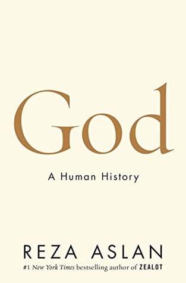

نفس الأمر يتكرر معي مؤخّرًا مع العديد من الكُتب التي أقرأها، أفرغ من الكتاب ويترك لدي "أحاسيس" مُختلفة حوله، عادة ما تكون مُتناقضة. وفي الكثير من الأحيان يُصعّب علي ذلك من مهمّة كتابة "لمحة سريعة" حوله، رغم أنني لا أنفي أن يكون للفارق الزمني (والذي قد يزيد عن الشهر) الذي يفصل ما بين الفراغ من الكتاب والكتابة حوله دور في الأمر.

من ناحية، رضا أصلان وأسلوبه الأخّاذ يجعلك تنغمس في الأفكار التي يُقدّمها وفي الحكاية التي يسردها وفي جميع تفاصيلها وتتمنّى أن لا ينتهي الكتاب وأن لا تنتهي فصوله، لكن من جهة أخرى وبعد أن أخذ الكاتب وقته لينقل لك تفاصيل الفصول الأولى بشكل دقيق يسمح لك بأن تعيشها لحظة بلحظة، إلّا أنني أحسست ولدى الوصول إلى الفصول الأخيرة منه وكأنّه تسرّع في إنهائه، أو وكأنّه نسي نفسه في دقائق الفصول الأولى، مما جعله لا يجد الوقت الكافي للتفصيل في آخر الكتاب والذي يُفترض -أو على الأقل من وجهة نظري- أن يكون الأهم والأكثر دسامة ووزنًا.

عجّل يا رجل، هكذا أتخيّلك تقول الآن أيها القارئ، وتتساءل "أوتحاول أن تُطبّق علينا أسلوب الكاتب هنا أيضا؟ قد أطلت الحديث ولم تُخبرنا بعد عن ماذا يتحدث”.… تذكّرت لتوي أنني أكتب لنفسي (رغم أنني أنشر ما أكتبه وأجعله مُتاحًا للجميع) وهو ما يدفعني للتساؤل… عن آي قارئ أتحدث؟ يبدو لي بأن رضا أسلان وبقصصه التي تأخذك إلى عالم ما وراء الطبيعة قد أثّرت فيّ؟ أو ربما بكل بساطة نال النُعاس مني. أين كنت؟ آه… أتحدث عن كتاب أصلان (نعم كتبها مرّة بالسّين ومرّة بالصّاد)… دعنا نعد إلى صلب الموضوع

الكتاب يتحدّث عن رحلة الإنسان منذ بداياته (أيّا كانت تلك البداية) مع الإيمان ومع فكرة الرّب/الخالق/الإله. يشير الكاتب إلى أن الإيمان بفكرة "الروح" هي أول ما آمن به الإنسان ويستعرض بعض الأدلة والآثار التي تُعتبر أقدم دلائل على إيمان الإنسان الأول بفكرة الروح وبفكرة الإله أو المعبود وهو الإله الذي كان دائمًا -حسب الكاتب- يحمل صفات إنسانية، بل ويذهب الكاتب إلى أن الإيمان قد لا يكون خاصّية بشرية بحتة، في استعراضه لما قد يمثل مثالًا عن الإيمان عند الهومو إيركتوس.

يشير الكاتب إلى أن الإيمان وكأنه حاجة بيولوجية أو نتيجة حتمية لتطوّر الإنسان (بالمفهوم الدارويني) يرصد الكاتب تطوّر فكرة الإيمان بخالق وبتعدد الآلهة، كما أنه يربط ما بين تحوّل البشرية من الصّيد إلى الزراعة وكيف أنه من الوارد جدًا أن يكون للدين دور مُهمّ في الأمر. كما يرصد مُختلف المُحاولات التي قام بها الإنسان للتحّول من تعدد الآلهة إلى إيمان بإله واحد (ليس الأمر مُتعلّقا بالضرورة بإله الديانات الإبراهيمية)، حيث يُشير الكاتب إلى أن أولى هذه المُحاولات كانت مع الفرعون إخناتون الذي حاول أن يفرض فكرة الإيمان بـ "آتون" آله الشمّس، إلا أن المصريين القدامى ما لبثوا أن عادوا إلى تعدد الآلهة بعد موته، بسبب حاجتهم -حسب الكاتب- إلى أنسنة الإله (إعطائه أوصافا بشرية)، وهو أمر لا يُمكن الوصول إليه إلّا عبر نافذة تعدد الآلهة. كما أشار إلى دعوة زرادشت إلى إله واحد ما لبثت أن حوّلها أتباعه من بعد إلى ديانة مثنوية كونية وليس توحيدية (ثنائية الخير والشر).

أمر لفت انتباهي والمُتمثّل -حسب الكاتب- في أن الديانة اليهودية القديمة في أصلها لم تكن توحيدية بالمفهوم الذي نعرفه الآن (عبادة إله واحد لا شريك له في الألوهية) وإنما كانت ديانة تخص عبادة إله واحد ولا تنفي صفة الألوهية عن غيره من الآلهة، إلّا أن هزيمة مُعتنقيها على يد البابليين و الذين يؤمنون بآله آخر أحدث أزمة لدى اليهود، فإن كان الإله الذي يعبدونه هو الأفضل/الأقوى/الأحق بالعبادة فلماذا لم ينصرهم، مما دفع باليهود إلى التحول إلى التوحيد ونفي صفة الألوهة عن غير معبودهم.

حسب الكاتب فإن المسيحية بمفهومها الحالي (أو على الأقل بمفهومها الذي يؤلّه المسيح) يُعتبر خُطوة إلى الوراء فيما يتعلّق بتخليص فكرة الإله من الأوصاف البشرية (من الأنسنة) حيث أعادة فكرة تأليه المسيح الرّب إلى ما كان يؤمن به الأوّلون بشكل أو بآخر، قبل أن تعود البشرية إلى "رشدها" مع الإسلام والعودة بقوة إلى فكرة التوحيد وتخليص الرب من الأنسنة.

وهنا خيّب الكاتب ظني كثيرًا، فبعد التفصيل والإطالة الذي كنت لأصفه بالإطناب والتفصيل المُمل لولا أسلوبه الأخّاذ، تجده يهرول (أو ربما يركض) لما يصل إلى الإسلام وإلى التوحيد الذي جاء به، وسارع إلى الانتقال إلى الموضوع الذي يُهمّه أكثر والمُتعلّق بالصّوفية، حيث يرى الكاتب بأنه إن كان الإسلام هو عودة البشر إلى التوحيد من جديد فإن أفضل صور ذلك الإسلام هو التصوّف الذي يُلخصّه في فكرة وحدة الوجود (هل فعلًا يُمكن حصر التصوّف في ذلك؟)، حيث يرى الكاتب أن هذا المفهوم هي الفكرة الوحيدة التي يُمكن من خلالها تنزيه الخالق من أي نقص أو خلل.

ينهي الكاتب كتابه بقوله بأنه يعتنق هذه الفكرة (أي أنه متصوّف)، بعبارة أخرى وكأن رضا أصلان كتب هذا الكتاب ليس ليحكي قصّة الخالق وإنما ليحكي قصّته في اكتشافه للخالق وبوصوله إلى التّصوّف، حيث بدأ أول فصل في الكتاب بذكره كيف كان مُسلما في صغره ثم يتنصّر لبعض الوقت قبل أن يعود إلى الإسلام من جديد.

هل أنصح بالكتاب؟ أكيد. على الأقل بسبب الأسلوب الرائع في السرد رغم أنه ترك لدي إحساسًا بأنه تسرّع في نهايته ورغم أنه قد لا يكون أعطى أهم موضوعين في كتابه (الإسلام والتصّوّف) قدرهما من الاهتمام.

بالمناسبة، قد ترغب أيضا في قراءة كتاب آخر لنفس الكتاب والذي يتحدث عن المسيح

Zealot: The Life and Times of Jesus of Nazareth

ستجد مُراجعتي له هنا:

https://www.goodreads.com/review/show/1975316606?book_show_action=false&from_review_page=1
