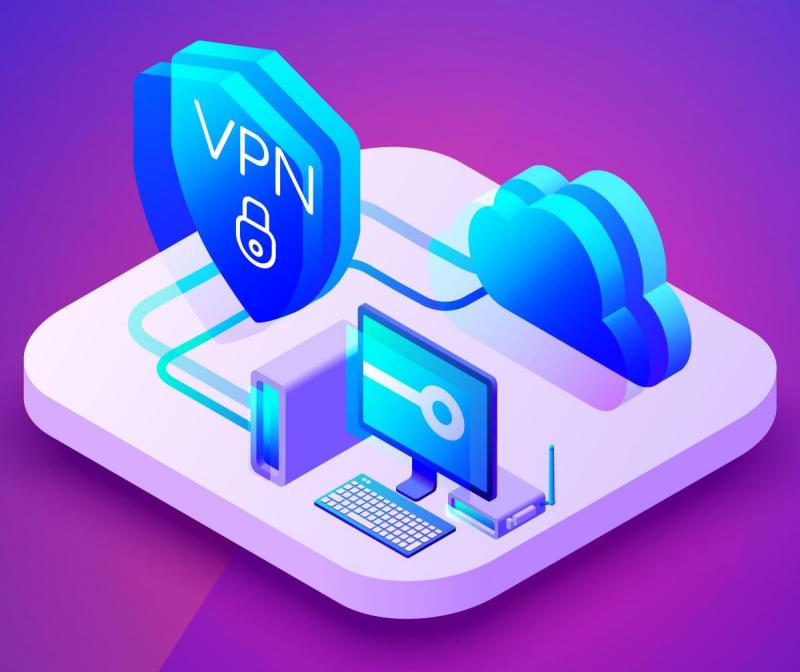

هناك توجّه مُقلق في السّنوات القليلة الماضية والمُتعلّق بشروع العديد من الشّركات التي تُقدّم خدمات VPN في تسويق خدماتها إلى عامّة المُستخدمين ممن لا يملكون خلفيات تقنية. صحيح أن اهتمام عامّة المُستخدمين بمسائل الخصوصية هو أمر محمود في حدّ ذاته، إلّا أنّ الشّكّ يُساورني كلما لاحظت كيف تستغل هذه الشّركات خوف عامة المُستخدمين على خصوصياتهم لأهداف تجارية بحتة. استخدام VPN قد يكون له عواقب وخيمة وقد يكون أسوأ من عدم استخدام أية خدمة VPN من أساسه إن لم تُحسن الاختيار.

صحيح أنه لدى استخدامك لخدمة VPN فإن المواقع التي تزورها لا يُمكنها معرفة عنوان IP الذي تتصفّحها من خلاله، وعادة ما يُستخدم هذا العنوان لمعرفة موضعك الجغرافي التقريبي (المدينة أو الحي مثلًا). لكن الأمر لا ينطبق على مُزوّدي خدمات VPN أنفسهم والذين يُمكنهم معرفة تفاصيل أكثر عليك لأنّك تستعين بخدماتهم للاتصال بالإنترنت. كما أن مُزوّدي هذا الخدمات قد يقّدمون وعودًا بعدم تعقّبك أو عدم حفظ تاريخ تصفّحك أو بيع تلك البيانات للشّركات الإعلانية، كما أنّهم قد يعدونك بعدم تسليم بياناتك لسلطات بلدك. نعم قد يعدونك بكل هذا، لكن سيبقى بإمكانهم القيام بكل هذا دون علمك. بحكم أنك ستمرر جميع اتّصالاتك بهذه الخدمة فإنها ستعرف جميع تفاصيل تصفّحك للإنترنت.

فائدة أخرى تُقدّمها خدمات VPN وهي أنها تمنع مُزوّدي خدمات الإنترنت ISPs من معرفة ما الذي تقوم به على الإنترنت. إن كنت لا تثق بمزوّد خدمة الإنترنت لكنّك تثق في مُزوّد خدمة VPN فقد يكون استخدام VPN في هذه الحالة خيارًا صائبًا، كما أنه سيُعتبر خيارًا صائبًا أيضًا لمّا ترغب في الاتّصال بالإنترنت من خلال شبكة مفتوحة/مجانية (مثل شبكات الإنترنت في المطارات)، لكن لا تنس بأنّك تضع ثقتك الكاملة في مُزوّد خدمة VPN التي تستخدمها. يجب عليك أن تجري بحثًا جيّدّا قبل أن تقرر استخدام خدمة VPN بدل أخرى، فعلى سبيل المثال هل تعرف البلد الذي تنشط منه تلك الخدمة؟ وما طبيعة العلاقات الديبلوماسية ما بين هذا البلد والبلد الذي تقطن فيه؟ وهل يُمكن لسلطات ذلك البلد أن تجبر مُزوّد خدمة VPN أن تُسجّل نشاطك وتكشف بياناتك الخاصة؟ هل تعتمد هذه الخدمة على رؤوس المال المُخاطر Vcs مما يعني بأن الشركة قد تضطرّ لاحقًا للرّضوخ لضغوط المُستثمرين وتبيع بياناتك بُغية تحقيق أرباح إضافية؟ ما الذي قد يحدث لك ولبياناتك إن تعرّضت الشركة لضائقة مالية؟ وهل تثق جيّدّا في قدراتهم الأمنية؟ هل تعتقد بأنه يسهل اختراقهم؟ إن لم تستطع الإجابة على جميع هذه الأسئلة فمن باب أولى أن لا تستخدم VPN.

ما يقلقني أكثر هي تلك الحملات الإعلانية التي تروّج لخدمات VPN مضمّنة مع أجهزة أو تطبيقات أخرى. ما يقلقني هنا هو أن من يكتب هذه التطبيقات هم مبرمجون يُفترض بهم أنّهم يعون جيّدًا أخطار ما يقومون به ويعرفون بأنه لا يفترض بهم القيام بذلك. فعلى سبيل المثال لا الحصر يأتي مُتصفّح Opera مُضمّنّا بخدمة VPN مجّانية ولا تُخبرك سوى بالقليل قبل أن تشرع في إرسال بياناتك من خلالها. هل فعلًا تثق في مُتصفّح صيني وتعتقد بأنّه سيحترم خصوصيّتك؟

شركة Purism بدورها أعلنت عن شراكة مع Private Internet Access لتضمين خدمة VPN في جهازهم القادم Librem 5. في رأيي تُعتبر هذه الخطوة عديمة المسؤولية، وقد سبق وأن تبادلت رسائل إلكترونية طويلة مع مديرها التنفيذي Todd Weaver حول الأمر (الضمير هنا يعود على كاتب المقال الأصلي وليس المُترجم). يجب على الشّركات أن تتوقّف عن جعل مهمة تمرير كامل بيانات المُستخدم عبر جهات لا يعرف عنها شيئًا.

لكن ماذا لو كُنت في حاجة إلى استخدام VPN وليست لديك أيّة ثقة في هذه الخدمات التّجارية؟ هناك حلول أخرى. بداية أي موقع تزوره ويكون اتّصالك عبر HTTP**S** (يُمكنك معرفة ذلك بظهور قفل أخضر صغير في شريط العناوين في مُتصفّحك) فإن اتّصالك بهذا الموقع سيكون مُشفّرًا والبيانات التي ستحصل عليها أو سترسلها إلى الموقع سيتم تبادلها بشكل مُشفّر وآمن كما أنه لا يُمكن التّلاعب بها أو تغييرها لدى انتقالها ما بين جهازك وخادوم الموقع. بطبيعة الحال فإن استخدام HTTP**S** لن يمنع الموقع أو مزوّد خدمة الإنترنت من معرفة عنوان IP الخاص بك، لكن جميع البيانات التي تتبادلها مع الموقع ستكون آمنة ومشفّرة. إن كنت تحرص دائمًا على استخدام HTTPS (أو أي شكل من أشكال SSL على جميع نشاطاتك على الإنترنت مثل البريد الإلكتروني) فإنه من المُرجّح جدًا أنك محمي بما فيه الكفاية*.

إن لم يكن ذلك كافيًا في نظرك فإن الحل الأمثل سيكون في استخدام [Tor](https://www.torproject.org/). لدى استخدامك لـ Tor للاتصال بموقع ما فإنه سيُخفي عنوان IP الخاص بك على الموقع الذي تتصّل به (أو أي مُتطفّلين يحاولون ترصّدك) وسيخفي هويّة الموقع الذي تتصّل به وما الذي تبادلته معه من بيانات على مُزوّد خدمة الإنترنت. كما أنه وفي بعض الحالات (خدمات onion) فإنها تخفي هويّة الموقع التي تتحدث معه عنك. بطبيعة الحال فإن استخدام Tor له عيوب ونقائص (الأمن والخصوصية)، و[يجب عليك أن تقرأ حول الأمر وتفهمه جيّدًا](https://2019.www.torproject.org/download/download.html.en#Warning) قبل استخدامك له، حيث يُمكن لبعض الجهات "الخبيثة" على شبكة Tor أن تتلاعب ببياناتك إن لم تكن تستخدم SSL أو توجيهات Onion (أو ما يعرف بـ Onion routing).

وأخيرًا إن كانت لديك المعرفة التّقنيّة اللازمة فإنّه بإمكانك أن تُجهّز خدمة VPN خاصة بك. إن كنت تملك خادومًا أو كان بإمكانك استئجار واحد لدى مُزوّدي خدمات VPS فإنه بإمكانك تنصيب VPN عليه. أنصحك باستخدام [Wireguard](https://www.wireguard.com/) (الأسهل استخدامًا، لكن مُتوفّر على لينكس فقط) أو [OpenVPN](https://openvpn.net/) (أعقد لكنّه يدعم كل شيء). لكن من جديد، قيامك بهذا الأمر يأتي بنقائصه وعيوبه أيضًا. حيث أنّك ستستخدم دائمًا عنوان IP نفسه في كل اتّصالاتك، مما يعني بأن بعض الخدمات سيسهل عليها تذكّرك وتتبّعك، بعبارة أخرى وكأنّك استبدلت مزوّد خدمة الإنترنت بمزوّد آخر (مُزوّد VPS الذي استأجرت الخادوم لديه). رغم ذلك فإن مزوّد VPS الذي ستختاره سيستخدم بالضّرورة مزوّد خدمة إنترنت تجارية والتي عادة لا تقوم بالمُمارسات التي يقوم بها مزّودو الخدمات الموجّهة للأفراد من تضمين إعلانات في صفحات الويب أو إعادة توجيه استعلامات DNS الفاشلة إلى صفحات نتائج بحث خاصة (مليئة بالإعلانات). بعبارة أخرى، يجب عليك أن تتأكّد من مزوّد خدمة VPS ومن مزودي خدمة الإنترنت لديهم بشكل جيّد.

خلاصة القول: ستحتاج أن تعرف جيّدا وتفهم جيّدا الجهات التي تتعامل مع بياناتك قبل أن تتشاركها، سواء كانت مُشفّرة أو لم تكن كذلك. أيّا كان الخيار الذي سترسو عليه فإنه يجب عليك دائمًا أن تُنصّب إضافة منع الإعلانات (أنصحك بـ [uBlock](https://github.com/gorhill/uBlock/#installation)[ Origin](https://github.com/gorhill/uBlock/#installation)) على مُتصفّحك، استخدم بشكل حصري المواقع التي تُفعّل HTTPS، ويجب أن تحذر دائمًا من جميع التّطبيقات التي تستخدمها ومن جميع الإضافات التي تُنصّبها على متصفّحك، ومن جميع المواقع التي تزورها، فإن أغلبها سيرغب في التّجسّس عليك.

---

الهوامش:

*: أشار أحد القرّاء إلى أنه يُمكن التّلاعب أيضا بـ HTTPS إن كان هناك من يملك صلاحيات إدارة حاسوبك (حاسوب العمل مثلًا) ، حيث بإمكان رب عملك أن يُنصّب ترخيصًا خاصًّا يسمح له بالتّلاعب ببياناتك. بإمكان تطبيقات تنصّبها على جهازك أن تقوم بنفس الأمر، وعادة ما يحصل الأمر مع مُضادات الفيروسات (والتي تُعتبر في أغلب الحالات فيروسات في حد ذاتها). يُمكن أيضًا للجهات التي تملك من السّلطة والقوة لإرغام السّلطات التي تُسلّم التراخيص certificate authority (جهات حكومية مثلًا) أن تستصدر تراخيص لنفس الأهداف. الطريقة الوحيدة التي أعرفها والتي لا يُمكن اختراقها بهذه الطريقة هو الاعتماد على onion routing على Tor.

ترجمة -وبتصرّف- للمقال[Choosing a VPN service is a serious decision](https://drewdevault.com/2019/04/19/Your-VPN-is-a-serious-choice.html) لصاحبه Drew DeVault

الصورة البارزة من تصميم [vectorpouch ](https://www.freepik.com/free-photos-vectors/technology)[على freepik](https://www.freepik.com/free-photos-vectors/technology)
