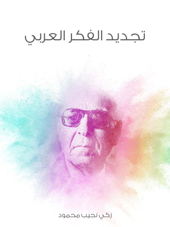

هل يُمكن الجمع ما بين ثقافة عربية أصيلة وما بين فكر مُعاصر؟ هذا هو السؤال الذي حاول الكتاب الإجابة عنه.

لاحظ الكتاب بأن المُثقف العربي بشكل عام ينتمي إلى أحد قسمين. قسم مُتمسّك بتراثه القديم ولا يحيد عنه قيد أنملة، فتجده يعتبر الفكر ما فكّر به الأوّلون، وأن الصواب ما اعتقد الأولون بصوابه، بل ويقصر العِلم على ما أنتجه الأوّلون. وقسم ينسلخ من هويّته كما تنسلخ الحيوانات التي تُبدّل جلدها القديم بجلد أجمل وأنظر، فتجده قد ولّى وجهه شطر الفكر الغربي واعتنق أفكاره وربما حتى مُعتقداته، بل وقد يتخلّى حتى عن لغته ظانًا منه بأن الخلاص يكمن في الخلاص من ذلك الحِمل الثقيل الذي يُسمى ثقافة عربية.

الكاتب يتساءل عن إمكانية الجمع ما بين الأمرين، هل يُمكن أن نحافظ على ثقافتنا ونعيش حاضرنا؟ وهل يُمكن أن تكون لنا ثقافة عربية في ظل التطور العلمي والفكري الذي يشهده العالم اليوم؟

الكتاب لم يُقدّم جوابًا كافيًا ووافيًا حول الموضوع رغم أنه أطال (وربما أطنب في) الشّرح، فتجد يُعالج الموضوع من أكثر زاوية ليصل بك إلى حل وسط. الحل -على الأقل حسبما فهمته من الكتاب- هو أن نكون أوفياء جدًا للفكر العربي وللثقافة العربية، والمقصود هنا ليس الوقوف عندما وقف عنده الأولون، بل المطلوب هو استخدام النهج الذي استخدمه الأولون لمعالجة قضايا عصرنا. فمثلما استعرضه الكاتب في صفحات كتابه، الثقافة العربية والإسلامية لم تولد جملة واحدة وإنما عرفت مراحل وتطوّرًا على مدار القرون، وكل قضية ومرحلة تجد فيها استحداث وسائل أو طرقًا لمُعالجة قضايا تلك المرحلة مع الحفاظ على "الروح العربية والإسلامية" لدى القيام بذلك.

بعبارة أخرى، وكأن الكاتب يرغب أن يقول أن الأزمة التي نعيشها الآن ليس أزمة نشأت عن التمسّك بالثقافة العربية بقدر ما هو تمسّك بالنتائج التي توصلت إليها أدوات تلك الثقافة لما استعملت على المشاكل والقضايا التي واجهت الفكري العربي آنذاك، وما علينا سوى أن نبقى أوفياء للمنهج (وليس للنتائج) ونستعمل أدواته فيما يواجهنا من قضايا مُعاصرة.

لأوضّح هذا الفكرة بمثال بسيط. لنفرض جدلًا أن الفكر العربي القديم عالج موضوع عملية "الجمع" (في الحساب) وشرح كيفية جمع عددين وضرب أمثلة عديدة، فهذا المثال نتيجته تساوي 5 وذلك المثال نتيجته تساوي 30. الإشكال هو أننا نتشبّث بهذه النتائج (5 و 30) ونعتقد بأنها الإجابة الوافية لجميع عمليات الجمع، في حين أنه يجب أن نعود إلى العملية في ذاتها ونطبقها على العمليات الحديثة التي تواجهنا في حياتنا اليومية.

الكتاب يعتمد أسلوبًا مُمتعًا في أغلبه (ومُدهشًا في بداياته)، وهو أقرب ما يكون من أسلوب شخص يُحادث صديقًا له ويشرح له تطوّر نظرته لمشكلة فكرية مُعيّنة منه إلى كتاب أكاديمي/جاف.

الكتاب مُتوفّر للتنزيل المجاني على موقع مؤسسة هنداوي للثقافة والنشر:

[https://www.hindawi.org/books/69496185/](https://www.hindawi.org/books/69496185/)
