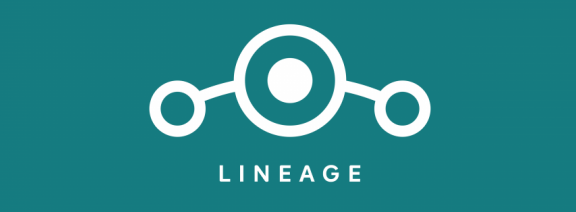
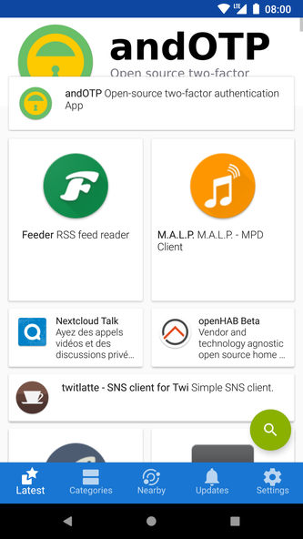
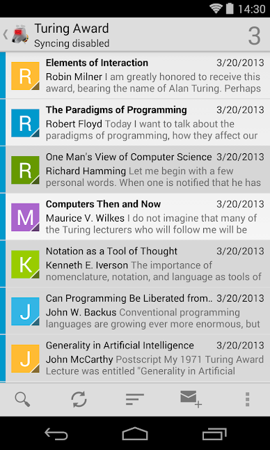

أحاول منذ فترة حماية خصوصيتي قدر المُستطاع، حيث أستخدم تطبيقات مفتوحة المصدر تضمن لي عدم تتبّعها لي وعدم جمعها بياناتي الشخصية، أستخدم إضافات منع الإعلانات على المُتصفّحات، كما أنني تخلّصت من حسابي على فيس بوك وأتجنب تنصيب أية تطبيقات مشبوهة على هاتفي يكون بمقدورها تتبّعي أو جمع بيانات حولي.

مؤخّرًا قرأت مقالًا حول تطبيق signal وكيف أن كاتب المقال لا يثق في التّطبيق. ما لفت انتباهي في هذا المقال هو وصف الكتاب لـ Google Play Services على أنّه [rootkit](https://en.wikipedia.org/wiki/Rootkit). يُطلق هذا الوصف على تطبيقات تملك أقوى الصلاحيات المُمكنة على جهاز ما ويستطيع إحداث أية تغييرات يرغب فيها وعادة ما يتم ذلك دون علم صاحب الجهاز/الحساب.

الإشكال هو أنه في حال ما إذا كنت تستخدم جهاز أندرويد فليس بإمكانك تعطيل Google Play services (أو على الأقل الأمر ليس سهلًا)، كما أن العديد من التطبيقات والخدمات التي تستخدمها تعتمد عليه بشكل كبير. أضف إلى ذلك جميع خدمات وتطبيقات Google التي يصعب على الكثيرين الاستغناء عنها، وأخص بالذكر كل من تطبيقات gmail، Youtube، Maps و Google Play ذاته الذي تُنصّب من خلاله باقي التطبيقات التي تستخدمها.

فما الحل إذن؟ الحل يكمن في استخدام النسخة مفتوحة المصدر من نظام أندرويد Android Open Source Project المعروف اختصارًا بـ AOSP وعدم تنصيب أي من خدمات جوجل.

## تنصيب Lineage OS

أول خطوة قمت بها هو الانتقال إلى [Lineage OS](https://www.lineageos.org/) (الذي يُعتبر الابن الشرعي لنظام [CyanogenMod](https://en.wikipedia.org/wiki/CyanogenMod)). يُعتبر Lineage OS نسخة من AOSP مُضافًا إليها بعض التطبيقات، وبعض الخصائص المفيدة، مثل حماية التطبيقات بكلمات سر (خاصّية مُضمّنة مع النظام) أو خاصيّة Privacy Guard التي تسمح بالتحكم بشكل كامل في كل الصلاحيات التي تطلبها منك التطبيقات التي تستخدمها.

إن كنت مُهتمًا بالانتقال إلى Lineage OS فتحتاج أولا من التّحقق من توفر نسخة خاصة بهاتفك، ومن ثم قراءة تعليمات التنصيب جيّدا قبل الشروع في تنصيب النظام. إن لم يسبق لك تغيير نسخة نظام هاتفك من قبل فقد ترغب في طلب مُساعدة شخص جرّب الأمر من قبل أو مُشاهدة فيديوهات أشخاص سبق لهم تنصيب النظام على نفس الجهاز الذي تنوي تنصيب النظام عليه.

تجب الإشارة هنا إلى أن Lineage OS يسمح لك بتنصيب تطبيقات/خدمات Google بما فيها Google Play services، لكن يتم توفير هذه التطبيقات [بشكل مُنفصل](https://wiki.lineageos.org/gapps.html) عن نسخة النظام.

## الحصول على التطبيقات

بعد إقلاع النظام لأوّل مرة ستلاحظ غياب أية طريقة "مُباشرة" للحصول على التطبيقات. الأمر راجع بكل بساطة إلى عدم تضمين Lineage OS أي متجر تطبيقات.

بداية ستحتاج أولا إلى تنصيب متجر/تطبيق [F-droid](https://f-droid.org/)، والذي يحتوي تطبيقات مفتوحة المصدر فقط. هناك من المُستخدمين من سيجد كل ما يرغب فيه على هذا المتجر، لكن إن كنت ترغب في الحصول على نفس التطبيقات التي ألِفت تنصيبها من قبل فالحل يكمن في استخدام متجر [Yalp](https://f-droid.org/en/packages/com.github.yeriomin.yalpstore/) (لاحظ أن اسم هذا المتجر هو play مكتوبة بترتيب عكسي للحروف) والذي ستجده متوفّرا في متجر F-droid.

يسمح Yalp بتحميل ملفات APK مُباشرة من متجر Google Play دون الحاجة إلى تسجيل حساب أو دون أن تتبّعك Google. إن سبق لك شراء تطبيقات مُعيّنة من على متجر Google Play فقد ترغب في تسجيل دخولك إلى التطبيق (تسجل دخولك على Yalp لكن باستخدام حسابك على Google play) مما يسمح لك بالوصول إلى كامل التطبيقات التي سبق لك شراؤها. بإمكان Yalp الحصول على التحديثات وتنصيبها أيضًا. بعبارة أخرى ومع استخدامك لـ Yalp فستحصل على جميع التطبيقات التي سبق لك استخدامه قبل تخلّصك من Google Play services.

## 

## ماذا عن تطبيقات Google ذاتها (Gmail، Maps، Youtube …)

الآن بعد أن وجدت طريقة لتنصيب تطبيقاتك دون الحاجة إلى Google Play Services فالسؤال التالي الذي سيخطر على بالك هو: ماذا عن Gmail؟ وهل سيكون بمقدوري مشاهدة Youtube ؟

ما قمت به هو التالي:

### Gmail

فيما يخص تطبيق Gmail، فقد كنت أعدّ العّدة من قبل، حيث شرعت في الانتقال إلى خدمة [protonmail](https://protonmail.com/) بشكل تدريجي (ما زلت لم أنتقل بشكل كامل بعد)، إضافة إلى توقفي عن استخدام تطبيق gmail في حد ذاته واستبداله بتطبيق [K-9 Mail](https://f-droid.org/en/packages/com.fsck.k9/) (مُتوفّر على Google Play أيضا من [هنا](https://play.google.com/store/apps/details?id=com.fsck.k9&hl=en_US)). بعبارة أخرى أبقيت على استخدامي على gmail دون الحاجة إلى وجود تطبيق gmail (وبالتالي خدمة Google play services) على هاتفي.

بداية الأمر بدا لي بأن التطبيق ليس بقوة gmail، لكن مع مرور الوقت لاحظت بأن استخدامي للبريد الإلكتروني على هاتفي بسيط جدًا، فلا أردّ على أية رسائل سوى باستخدام لوحة مفاتيح فيزيائية كاملة (يعني على حاسوبي) وكل ما أقوم به على الهاتف هو قراءة البريد، أرشفته، أو إضافة "نجمة" لأميّزه لاحقًا لما أفتح البريد على حاسوبي. بعبارة أخرى، لم أكن أصلا في حاجة إلى كامل قوّة تطبيق gmail على هاتفي.

## Youtube

كنت أتوقّع أن يكون استبدال تطبيق يوتيوب هو الأصعب. فكّرت بداية في الاكتفاء بنسخة الويب من الموقع لكن بدت لي الفكرة غير عملية إطلاقًا (ما لم تكن ترغب في القيام بذلك [عن قصد](https://twitter.com/amix3k/status/1124295608091721734) لكي تُقلّل من تضييع وقتك على يوتيوب). لكنني وجدت بدائل بدت في نهاية المطاف أقوى من تطبيق يوتيوب الأصلي، بل وتقدّم تجربة استخدام أفضل بكثير.

الأمر يتعلّق بكل من تطبيقي [NewPipe](https://f-droid.org/en/packages/org.schabi.newpipe/) و [Skytube](https://f-droid.org/en/packages/free.rm.skytube.oss/).

لكن ماذا عن جميع القنوات التي تشترك فيها على يوتيوب؟ كيف السّبيل إلى مُتابعة جديدها؟ الحل بسيط، حيث تسمح Youtube بتصدير جميع اشتراكاتك (يوفر التطبيقان رابطًا مباشرًا على صفحة الاستيراد) ومن ثم استيراد الاشتراكات في التطبيق الذي ترغب في استخدامه. وبهذا ستحافظ على نفس الاشتراكات وستشاهد نفس الفيديوهات، لكن هذه المرة دون أن ترتبط هذه المُشاهدة بحسابك على يوتيوب، إضافة إلى حصولك على تجرب استخدام أفضل بكثير.

فعلى سبيل المثال لا الحصر، يسمح تطبيق NewPipe بالاستماع إلى فيديوهات يوتيوب صوتًا (دون الحاجة إلى الصورة) كما يُمكن ذلك حتى ولو أغلقت شاشة هاتفك، وهو أمر لا يُمكن القيام به على التطبيق الأصلي ليوتيوب. أضف إلى ذلك سهولة تحميل الفيديوهات (و النسخ الصوتية منها)، عدم ظهور أية إعلانات. أضف إلى ذلك إمكانية التحكم في إضاءة الشاشة والصوت بمزايا تشبه تلك التي تجدها عادة على تطبيق VLC.

سبب استخدامي لتطبيق SkyTube إلى جانب NewPipe هو أن هذا الأخير على ما يبدو فيه علّة برمجة مُتعلّقة بسحب أحدث الاشتراكات بترتيب زمني صحيح، وبالتالي أحصل على هذا الترتيب على skytube ومن ثم أفتح الفيديو على NewPipe.

### Google Maps

لا أستخدم تطبيق Maps إلا نادرًا، لكنني لا زلت أبحث عن بديل جيّد له (في الحالات التي سأحتاج فيها إلى تطبيق مُماثل). وجدت عدّة تطبيقات مثل [Maps.me](https://f-droid.org/en/packages/com.github.axet.maps) أو تطبيق [OsmAnd+](https://f-droid.org/en/packages/net.osmand.plus/) لكن للأسف لحد الآن لم أتمكّن من استخدامهما بشكل جيّد.

### Calendar

تطبيق Calendar مُهمّ بالنسبة لي، حيث أعتمد عليه لتذكيري بأية أعمال يجب علي القيام بها في تواريخ مُحدّدة (خاصّة اجتماعات العمل). بالرغم من توفر تطبيق calendar على Lineage OS فلم يفِ بالغرض، حيث أنه -على ما يبدو- يصلح لمزامنة رزنامات مُتوفرّة في السحاب. استخدم تطبيق [Simple Calendar Pro](https://f-droid.org/en/packages/com.simplemobiletools.calendar.pro/) بحكم أن استخدامي بسيط. فكلما تصلني دعوة عبر البريد يأتي معها ملف invite.ics الذي يمكن تحميله واستيراد مُباشرة من خلال تطبيق Simple Calendar.

## تطبيقات لم تعد تعمل

لاحظت توقّف بعض التطبيقات عن العمل كلّيّة دون خدمات Google Play Services، حيث تظهر رسالة خطأ على التطبيق تُخبرك بأنه يعتمد بشكل كبير عليها ولا يدعم نسخ أندرويد التي لا تدعمه. لاحظت ذلك بشكل مُباشر على كل من تطبيقي Authy و todoist وهو أمر مؤسف حقّا. في رأيي يجب على أصحاب هذه التطبيقات السماح لها بالعمل، لكن مع إعلام المُستخدم بأنه لن يحصل على بعض الخصائص التي تعتمد على Google Play services. فعلى سبيل المثال تحتاج أغلب التطبيقات التي تعتمد على التنبيهات إلى هذه الخدمات لتوفير هذه الخاصّيّة.

انتهى بي المطاف إلى استخدام نسخة الويب من todoist (لا أستخدمه كثيرًا على أية حال)، أما فيها يخص تطبيق Authy للاستيثاق الثنائي، فهناك عدّة بدائل له مثل تطبيق [FreeOTP+](https://f-droid.org/en/packages/org.liberty.android.freeotpplus/) (نسخة مطوّرة من FreeOTP تسمح بتصدير واستيراد الحسابات).

## هل يعني عدم وجود تنبيهات بأن تطبيقات الدردشة لن تعمل؟

ليس بالضرورة. شخصيًا لم ألحظ ذلك، لكن ربما يرجع الأمر إلى طبيعة التطبيقات التي أستخدمها. أستخدم بشكل أساسي كل من تطبيقات telegram و Wire و Signal. في حين أن تطبيق تيليجرام لا يُبيّن الطريقة التي يعمل فيها من دون مشاكل في ظل غياب Google Play services إلا أنه ربما يعتمد على ما يعتمده تطبيقا signal و Wire حيث يُبقيان على اتصال دائم بالخادوم وبالتالي الحصول على جميع التنبيهات دون الحاجة إلى خدمات جوجل. تجدر الإشارة إلى أن هذه الطريقة من شأنها أن تستهلك طاقة أكبر (وبالتالي عمر بطارية أقل).

## تطبيقات أخرى استبدلتها

هدفي الأساسي من كل هذا الأمر هو حماية خصوصيّتي، وعليه أفضل استخدام تطبيقات مفتوحة المصدر (حتى ولو لم تكن مجانية) على غيرها وبحكم أنني صرت أعتمد على F-Droid أكثر حاولت استبدال تطبيقات أخرى قدر المستطاع. بعضها يوفر لي ما كانت توفره التطبيقات مغلقة المصدر (والتي لا أدري إن كانت تحترم الخصوصية أو لا) وبعضها لا زلت في طور التجربة والبحث عن بدائل جيّدة.

### 

### فيرفكس

أستخدم فيرفكس كمتصفحي الرئيسي منذ سنوات سواء على الهاتف أو على الحاسوب. كنت أستخدم أيضا chrome (بحكم أنه يأتي منصبّا مع أي نسخة من أندرويد) إلا أنني لم أقم بذلك هذه المرة (رغم أن "المتصفح القياسي" الذي يأتي مضمنا مع Lineage OS يشبه إلى حد كبير chrome).

إضافة إلى فيرفكس أستخدم نسخة أخرى منه تُسمّى [Firefox Focus](https://play.google.com/store/apps/details?id=org.mozilla.focus&hl=en_US) والذي يكون التصفح عليه عادة أسرع بحكم تعطيله لجميع الإعلانات والسكربتات التي تتبعك على المواقع التي تزورها. لا يحفظ Firefox focus تاريخ التصفح أيضًا.

### 

### SyncThing

يسمح تطبيق SyncThing بمزامنة الملفات على أكثر من جهاز دون الحاجة إلى المرور عبر أية خواديم طرف ثالث (أو على الإنترنت بشكل عام). فعلى سبيل المثال يُمكن لك أن تستخدم التطبيق لمزامنة مجلد الصور على هاتفك مع حاسوبك ونقل أية صور جديدة تلتقطها بمجرد أن تكون على نفس الشبكة مع حاسوبك. سبب استخدامي لـ syncThing هو رغبتي في إيجاد بديل لـ dropbox. إلى غاية كتابة هذه السطور لم أجد بعد طريقة لجعله يعمل بنفس طريقة دروب بوكس، يعني يزامن الصور، لكن إن حذفت الصورة من على الهاتف لا تُحذف على حاسوبي، حيث أن التطبيق يُزامن كل شيء بما في ذلك عمليات الحذف. إن كانت لديك فكرة عن كيفية استخدامه كبديل كامل لدروب بوكس فلا تتردّد في مُشاركتي برابط يشرح كيفية القيام بذلك.

قد ترغب في الاطلاع على تدوينة طريف حول استبدال الخدمات السحابية بخدمات محلية:

[اضرب جذورك في الأرض](https://blog.tareef.me/offline-computing/)[. بدائل محليّة لأكثر الخدمات السحابية شيوعًا](https://blog.tareef.me/offline-computing/)

### Markor

[Markor](https://f-droid.org/en/packages/net.gsantner.markor/) تطبيق مفتوح المصدر يسمح بتدوين ملاحظات على هيئة ماركداون. ما زلت لم أألف استخدامه بعد. يُمكن أن يصبح بديلا جيّدا عن Google keep خاصة إذا ما تم استخدامه مع تطبيق syncThing آنف الذكر لمزامنة الملاحظات مع حاسوبك.

### Red moon

يُعتبر [Red Moon](https://f-droid.org/en/packages/com.jmstudios.redmoon/) بديلًا حرًا ومفتوح المصدر لتطبيق Twilight الذي يعدّل إضاءة الشاشة ليلا للتخلص من "الإشعاعات الزرقاء"

## تطبيقات أخرى

تطبيق آخر وددت إضافته إلى قائمة ما ذكرته هنا ويتعلّق الأمر بتطبيق [Adaway](https://f-droid.org/en/packages/org.adaway) (يتطلب root) والذي يسمح لك بتعطيل الإعلانات على كامل النظام.

## هل الانتقال سهل وهل يستحق كل هذا العناء؟

لن أكون صادقًا معك لو قلت لك بأن الانتقال كان سهلًا علي، ربما الأمر راجع إلى أنني في كثير من الحالات أجد التغيير صعبًا، أو ربما لأن تغيير عادات/تطبيقات قديمة ألفتها منذ سنوات ليس بالأمر السهل. ويذكّرني هذا الانتقال وبعض الصعوبات (النفسية في مجملها) بالصعوبات التي واجهتها لما قررت الانتقال بشكل كامل إلى نظام لينكس منذ عدة سنوات. أو ربما يرجع الأمر إلى تغلغل تطبيقات جوجل وخدماتها في حيواتنا بشكل يصعب التخلّص منها. لكن في نهاية المطاف ألفت الأمر.

لكن كما تلاحظه في الفقرات السابقة، الأمر ليس تغييرًا جذريًا تقوم به ما بين عشية وضحاها، لكنه يتطلّب وقتًا وصبرًا وسعة صدر. فكما أشرت إليه لا زلت لم أجد بعض البدائل المناسبة لبعض التطبيقات وقد يتطلب منك الأمر تجربة أكثر من تطبيق قبل أن تجد ضالتك.

لكن في المقابل، دفعتني عملية الانتقال هذه إلى إعادة التفكير في كيفية استخدامي لهاتفي ومحاولة جعل هاتفي أداة تخدم أهدافي (ومبادئي) وليس العكس.

فعلى سبيل المثال، وبالرغم من الأمر لا علاقة له بالمصادر المفتوحة، أحاول أن أقلل من التنبيهات والملهيات على هاتفي وجعله وسيلة لاستهلاك المُحتوى المفيد (قدر الإمكان) من كتب وكتب صوتية وبودكاست ومقالات بشكل أساسي. إن كنت مهتما بهذا الموضوع بالذات فقد ترغب في الاطلاع على كتاب Digital Minimalism (ستجد "لمحة سريعة" كتبتها حوله هنا [: كيف تستعيد حياتك التي اختطفتها التقنية والشّبكات الاجتماعية منك: لمحة سريعة حول كتاب Digital Minimalism](https://www.it-scoop.com/2019/04/digital-minimalism-book-review/))

## خلاصة

هدفي من هذا المقال هو الإجابة على هذا السؤال: “هل يُمكن استخدام هاتف أندرويد دون جوجل و/أو خدماتها" والإجابة على الأقل فيما يخصّني هو "نعم".

قد يكون الأمر راجعًا بشكل أساسي إلى استخدامي البسيط للهاتف. فلست أعتمد سوى على تطبيقات قليلة فقط بشكل يومي، وهي تطبيقات إما أنها لا تحتاج إلى التنبيهات أو أنها وجدت طريقة للحصول عليها دون خدمات جوجل.

كنت أرغب في كتابة هذا المقال لعلّك ترغب في الانتقال أيضًا وتود الاطلاع على تجربة من قاموا بنفس الأمر. ما أعطاني دفعة إضافية للكتابة حول هذا الموضوع هو كل اللغط حول موضوع الحرب الاقتصادية ما بين الصين وأمريكا وما ترتب عنه من "قطع" تحديثات أندرويد على المُصنّع هواوي وكثرة الأسئلة عن إمكانية استخدام نظام أندرويد من دون جوجل، وأتمنى أن أكون وُفّقت ولو جزئيًا في تسليط الضوء على ما يُمكن القيام به باستخدام الإصدار مفتوح المصدر من نظام أندرويد.

