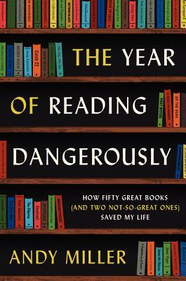

أردت من أعماق قلبي أن يعجبني كتاب  **The Year of Reading Dangerously **(تُرجم إلى العربية تحت عنوان: ** سنة القراءة الخطرة**). أردت فعلًا ذلك. سارعت لشرائه بمجرد أن قرأت مراجعات وآراء تنصح به، بل وبمجرد شرائه سارعت إلى إنهاء الكتاب السابق الذي كان بين يدي، بل وحتى حاولت التأني في قراءته للاستمتاع به قدر الإمكان. لكن للأسف خاب ظني. إلا أنني خرجت من الكتاب ببضعة خلاصات أرجو أنها ستساعدني في اختيار الكتب القادمة بشكل أفضل.

بداية، الكتاب عبارة عن ملاحظات وآراء الكاتب حول الكتب التي قرأها (عددها 50) خلال عام واحد. الكاتب يعمل كمُحرر كتب، ولاحظ بأن هناك عددا من الروايات من الأدب العالمي والتي يدّعي الكثيرون قراتها إلّا أن قلّة قليلة فقط من قامت بذلك، وبحكم أنه ينتمي إلى هذه الفرقة (التي لم تقرأها) قرّر أن يُصحّح الوضع بقراءتها، ويحكي لنا ما استخلصه وتعلّمه خلال تلك الفترة.

البداية كانت قوّية ومُمتعة ومُشوّقة، لكن الفصول تتعاقب وينفّرك بعضها من الكتاب أكثر من بعض. هممت بوضع الكتاب جانبًا، وربما حتى إرجاعه واسترجاع المبلغ الذي دفعته مقابله، لكن أثناء ذلك كان الكاتب يتحدث عن قصّة شبيهة، كتاب لم يستسغه ووضعه جانبًا، إلّا أنه عاد إليه وأكمله بعد ذلك، فقلت، ربما من الأفضل أن أواصل القراءة مثلما فعل، فلربما سأصل إلى نتيجة أو خلاصة مع نهاية الكتاب.. تذكّر أنه ذكر بأن هذه الكتب "أنقذت حياته"، وقد أجد من الدُرر الثمينة في نهاية الكتاب ما يستحق عناء الانتظار.

كم كنت ساذجا في اعتقاد ذلك. لم أستسغ أيًا من تلك الفصول، ربما باستثناء الفصل الذي تحدث فيه عن تولستوي وعن روايته "الحرب والسلم"، رواية دائما ما رغبت في قراءتها، إلّا أن طولها المُتناهي دائما ما وقف حائلا بيني وبينها. لكن على الأقل خرجت بلمحة عن الفائدة التي قد أجنيها من قراءة مثل هذه الروايات، وكيف أنها ليست رواية بالمفهوم المُتعارف عليه، بل أي أكبر من ذلك وأعمق. قد أعود لاحقًا وأقرأها، من يدري… قد يكون سبب قراءتي لها هو كتاب أعتبره من أسوأ ما قرأت هذا العام.

للأسف، فإن هذا الكتاب رسّخ لدي الفكرة/القناعة التي كانت لدي والتي أعتقد في قرارة نفسي أنها خاطئة، فما زلت لم أجد من الأدلة الكافية ما يجعلني أغيّر رأيي، والتي مفادها أن قراءة الروايات مضيعة للوقت في أغلب الحالات، وأن الحالات القليلة التي يمكن أن "أجيز" قراءة الرواية فيها (خارج دائرة تحسين اللغة) هو الاطلاع على أفكار عميقة أو فلسفات، يكون من الصعب فهمها واستيعابها بشكل جيّد إن لم تُقدّم في قالب قصصي. من بين أفضل ما قرأت وينطبق هذا الوصف عليه هي رواية Origin لكاتبها دان براون (فلسفي بامتياز)، والذي حظي بقسط وافر من السخرية في هذا الكتاب الذي أنا بصدد الحديث عنه. فكرة أخرى جانبية أعتقد بأنها خاطئة أيضًا ولم أجد من الأدلة ما يدحضها بعد: ربما من الأفضل أن نتوقّف عن تسمية الروايات بـ "الكتب" ونكتفي بتسميتها بـ "الروايات" ليسهل التفريق بينهما.

دائما ما أحس بأن قراءة الكتب الكلاسيكية وخاصة الأدب الروسي أمر ضروري. لست أدري إن تغيّرت نظرتي إلى الأدب الروسي بعد قراءة هذا الكتاب، لكن من المؤكّد أنني لن أحاول -على الأقل في المدى القصير- قراءة روايات كلاسيكية (خارج دائرة الأدب الروسي)، خاصة تلك التي ورد اسمها في هذا الكتاب.

بحكم أنه لا يوجد أي خطر في الكتب التي قرأها ولم تنقذ حياته (التي لم تكن أصلا في خطر)، ربما كان الأجدر بالكاتب أن يسمي كتابه بدل "سنة القراءة الخطرة: كيف استطاع خمسون كتابًا عظيما إنقاذ حياتي" أن يختار له عنوان أقرب للواقع، مثل "سنة القراءة المُملّة: دعني أغيّر نظرتك لروايات الأدب العالمي للأسوأ وإعطائك سببا آخر لتجنب قراءتها".

خلاصة القول: أفضل ما في هذا الكتاب عنوانه. إن كنت تقرأ لتزيد دائرة معارفك وليس للمتعة، فمن الأفضل أن تصرف مالك ووقتك على كتاب آخر.
