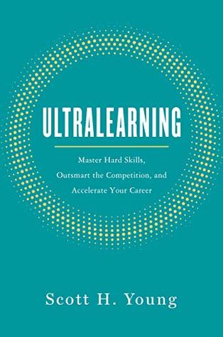

من الكتب التي قرأتها لأنه سبق لي أن قرأت مقالات لكاتبها. من الكتب التي أيضا رغبت أن تعجبني كثيرًا لكنني لم أجد ضالتي فيها (أو ربما وجدت بعضًا منها فقط). كتاب يشرح كيف يُمكن لك أن تتعلّم أي مجال/موضوع ترغب فيه بطريقة ذاتية، تكون مُنظّمة ومركّزة.

اشتهر الكاتب بتجربة سبق وأن خاضها والمُتعلّقة بإكمال مُقرر علوم الحاسب في جامعة MIT الذي يمتدّ على 4 سنوات خلال عام واحد فقط وبشكل مركّز وفردي/ذاتي، وهو أمر مُبهر في حد ذاته والسبب في الشهرة التي حقّقها الكاتب، رغم أن هذا الأخير سلك عدّة اختصارات shortcuts مثلما ذكر في آخر كتابه هذا. كما أنه تعلّم 4 لغات حيّة في عام واحد أيضًا من خلال انتقاله إلى كل بلد يرغب في تعلّم لغته وبذله كامل جهده في تعلّم تلك اللغة. بعبارة أخرى، ما يبدو من تجارب الكاتب أنه جرّب ما تحدّث عنه في هذا الكتاب بنفسه، رغم ذلك بدا لي وكأن الأمر فيه بعض الحشو وكثير من التضخيم.

ربما الخلاصة الأهم التي خرجت منها بعد الفراغ من هذا الكتاب أو هي قناعة ترسّخت لدي مؤخّرا (ربما بسبب أنني كنت أتابع مُحتويات أخرى في نفس فترة قراءة الكتاب أغلبها ذات جانب فلسفي) والتي تدور حول وجوب أن تكون لديك خطّة واضحة ومنهج جيّد لدراسة أي موضوع أو علم/فن. إضافة إلى ذلك فإن التدريب المُستمر والمركّز أمر ضروري للوصول إلى مستوى عالٍ من الفهم والتمكّن من أي موضوع كان. فعلى سبيل المثال القراءة من دون تطبيق أو حتى القراءة بشكل عشوائي دون نهج واضح ومدروس يُتّبع قد يعطيك إحساسًا خاطئًا بأنّك تكتسب المعارف التي ترغب في اكتسابها، لكن ربما تلك العشوائية في القراءة وقلّة/عدم التطبيق قد يجعل كل ذاك المجهود يذهب سُدًى أو ربما حتى يأخذك في الطريق الخاطئ بتكوين معارف/قناعات/أفكار أساسية تكون منقوصة أو حتى خاطئة بالمرّة.

الكتاب جيّد في مجمله، حيث أنه سيذكّرك (إن كنت نسيت) بالمنهج الواجب اتباعه من جديد لمواصلة الدراسة والتكوين خارج دائرة التعليم النظامي والذي عادة توفّر جوًا وتملك من المزايا ما يصعب تحقيقه خارجها، كما أنه قد يوقد شرارة التعلم الذاتي في داخلك إن هي أفلت أو آلت إلى الأفول.

للاطلاع على تحدي MIT آنف الذكر: [https://www.scotthyoung.com/blog/myprojects/mit-challenge-2/](https://www.scotthyoung.com/blog/myprojects/mit-challenge-2/)

كما يُمكنك مشاهدة هذه الفيديو حول نفس الموضوع:

[https://www.youtube.com/watch?v=piSLobJfZ3c](https://www.youtube.com/watch?v=piSLobJfZ3c)

قد ترغب في الاطّلاع أيضا على كتاب Make It Stick: The Science of Successful Learning
