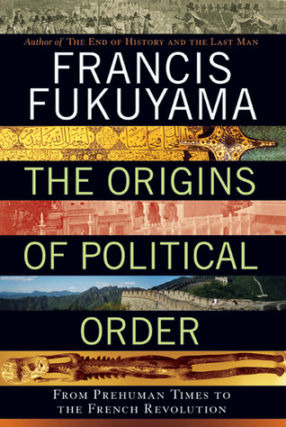

كتاب صعب المراس، طويل ودسم (ومُملّ في بعض الأحيان لكثرة التفاصيل، ولمحاولته أن يكون أكاديميا/ شاملًا للكثير من دقائق الأمور) لكنّه مفيد. يدرس الكاتب فرانسيس فوكوياما Francis Fukuyama مسألة "ما الذي يجعل الدول مُستقرة" ويُعبّر عن هذه الفكرة في بداية الكتاب بقوله "كيف نصل إلى الدنمارك" بمفهوم كيف نجعل دولًا معروف عنها انهيارها أو فشلها تتحول إلى دنمارك أخرى. يقارن الكتاب بين أكثر من دولة/نظام حكم على مر التّاريخ لمعرفة أسباب صعودها وسقوطها ليخلص إلى ما يجمع الدول المستقرة وما الذي يميّزها عن الدولة التي فقدت استقرارها وانهارت. يُمكن أيضا النظر إلى الكتاب على أنه دراسة لأسباب زوال الدّول، رغم أن هذا الموضوع يبدو وكأنه موضوع الكتاب الثاني الذي يقدّم له هذا الكتاب. تجدر الإشارة إلى أن الكاتب يتوقّف عند حدود الثورة الفرنسية، حيث أنه عالج الفترة التي تليها في الكتاب الثاني له.

## أسباب استقرار الدول

“إطار العمل" الذي يدور حوله محتوى الكتاب هو أن الدول المُستقرة تحتاج إلى توفر 3 أعمدة رئيسية تكون صلبة وقائمة في نفس الوقت:

1- دولة قوية ذات سلطة مركزية غير خاضعة للطائفية أو التبعية للقبيلة

2- قوّة/سلطة القانون والتي عادة ما يكون منبعها دينيا تحد من سلطة الطبقة الحاكمة

3- حكومة مسؤولة، خاضعه لسلطة الشعب الذي تحكم باسمه

ليبيّن صحّة نظريته، وعلى خلاف الكتّاب الغربيين الذين عادة ما يكتبون من وجهة نظر غربية وتركّز على الغرب فقط، فإن الكاتب يعود بك إلى الصين التي تُعتبر أول دولة بالمفهوم الحديث. لكن قبل الحديث عن الدولة الصينية احتاج الكاتب أن يشرح أولا كيف أن الإنسان هو "حيوان اجتماعي" بطبعه وأنه -عكس ما يُمكن أن نقرأه لدى العديد من الفلاسفة كـروسو وهوبز- لم يكن الإنسان أبدًا في حالة كان يعيش فيها بمفرده، بل عاش الإنسان في جماعات على مر تاريخه، واستشهد بالأمر بقردة الشامبانزي والتي تعيش في مجموعات بدورها أيضًا، مجموعات تهدف بشكل أساسي لأن "تقاتل" مع بعضها. لكن حسب الكاتب فإن البشر ذهبوا أبعد من ذلك عبر إنشائهم لمفهوم القبيلة.

بحكم أن القبيلة تحكمها بشكل أساسي روابط الدم والقرابة (باتريمونالية؟ patrimonialism ) فإن الانتقال إلى نظام حكم أشمل من القبيلة يتطلب فكرة أشمل من فكرة القرابة تسمح بضم أكثر من قبيلة في دولة واحدة وعادة ما تم الأمر عبر الأديان، ويضرب الكاتب مثالًا بالرسول صلى الله عليه وسلّم وكيف استطاع أن يوحّد القبائل العربية مع بعض تحت مظلة الدولة الإسلامية والانتماء إلى "الأمّة" بدل القبيلة.

## ظهور الدول بالمفهوم الحديث

المقصود بالدولة هنا يُمكن تلخيصه بوجود سلطة مركزية تنفرد بالحكم على رقعة جغرافية (وليس على قبيلة أو مجموعة مُحدّدة من البشر) وتملك بشكل حصري حق استخدام العنف بشكل شرعي (للإكراه أو الإجبار).

### الصين

عرفت الصين أول دولة بالمفهوم الحديث، لكنها افتقدت على مر تاريخها للعمودين الآخرين الذين لا تقوم الدول المستقرّة إلّا بهما (قوّة القانون والمسؤولية)، فلم يكن الحكام يخضعون للقانون (بل يحكم به)، كما أنهم لم يتورّعوا في استخدام العنف ضد شعوبهم كلما رغبوا في ذلك، مما يجعل الدولة الصينية على مر تاريخها (المدروس في الكتاب) دولة غير مستقلّة.

### الهند

على عكس الصين، فإن الهند ورغم أنها عرفت بداية مشابهة لبداية تكوين الدولة الصينية، إلّا أنها لم تستطع بناء نظام حكم مركزي ويعود الأمر بشكل أساسي لوجود قاعدة اجتماعية صلبة لم تسمح بظهور نظام الحكم المركزي، كما ساهم في إضعاف الطبقة الحاكمة كون انتشار الهندوسية على نطاق واسع وعلو درجة رجال الدين مقارنة بالحكام.

### العالم الإسلامي

قضى الكاتب جزءًا معتبرا من الكتاب في دراسة الدولة الإسلامية، حيث يُعتبر نشوءها من بين أفضل الأمثلة بخصوص الخروج من سلطة القبيلة إلى سلطة الدولة، لكنه ركّز أكثر على الدولة العثمانية ودولة المماليك، وكيف أنهما سقطتا بسبب تغير القوانين التي أدّت إلى نجاحهما في البداية، ويقصد هنا كيف أنهما استخدمتا العبيد كركيزة لنظام الحكم في البداية، حيث لم يكن بإمكانهم توريث الممتلكات أو المناصب، لكن الأمر تغير بشكل تدريجي مما ضرب الدولة في أساسها وأدت إلى سقوطها.

### الدول الأوروبية

ثم يعرج الكاتب على الدول الأوروبية، وكيف أن كل واحدة منها افتقدت أحد الأعمدة آنفة الذكر بشكل أو بآخر مما أدى إلى سقوطها، ثم يشرح كيف أن انجلترا كانت الدولة الأولى التي تجتمع فيها هذه الأعمدة كلها في نفس الوقت، مما أدى إلى استقرارها.

الكتاب مهم لفهم نشوء السياسة بشكل عام ولتكوين الدول واستقرارها بشكل خاص، يبدو محتوى الكتاب الثاني للكاتب (في نفس السلسلة) مهمًا، ويبدو لي لفهمه بشكل جيّد ستحتاج بداية لقراءة هذا الكتاب أولَا.

ملاحظة جانبية: بحكم الكم الهائل من المعلومات الواردة في الكتاب والتي تدل على سعة اطّلاع الكاتب، يتولّد لديك شعور بالاحترام للكاتب وآرائه، حيث أنك حتى وإن خالفتها فإن الكاتب على الأقل ممن يبحث بشكل عميق ولا يطلق أحكاما مُتسرّعة (هذا لا يمنع بالضرورة تسلل الإيديولوجيات إلى آرائه).

