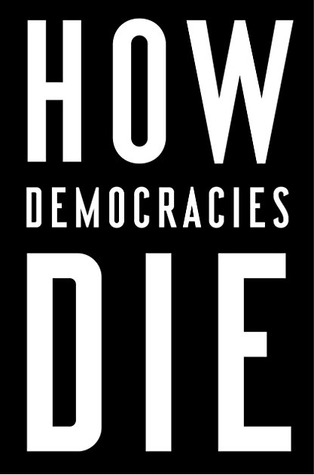

يُعتبر كتاب "كيف تموت الديمقراطيات" **How Democracies Die** دراسة تاريخية لموت عدّة ديمقراطيات في العصر الحديث، مع محاولة استنباط مجموعة من الخصائص المُشتركة فيما بينها، إضافة إلى محاولة استخراج جملة من الخصائص التي تُميّز القادة الذين تموت الديمقراطيات على أيديهم (أو بسببهم).

قد يكون التالي أهم ما في الكتاب:

- الديمقراطيات لم تعد تموت (خاصة بعد نهاية الحرب الباردة) كما قد يخطر على البال عبر الانقلابات العسكرية، فالأمر تطوّر، حيث أصبحت الديمقراطيات تُقتل من الداخل، عبر وصول أشخاص عبر الانتخابات، عادة ما يكونون ديماغوجيين/شعبويين demagogue ودخلاء على السياسة، إلى سدّة الحكم ومن ثم يقومون بهدم أركان الديمقراطيات وإضعاف مؤسساتها شيئا فشيئا حتى تنهار أو لا يبقى من الديمقراطية التي وصل بها إلى سدة الحكم سوى الاسم/القشرة الخارجية. ضرب الكتاب أمثلة عديدة لدول حدث فيها هذا الأمر في مناطق مُختلفة من العالم.

- ما الذي يسهل وصول الشخصيات الديماغوجية/الشعبوية إلى سدة الحكم وما الذي يصلح عادة لمنعهم من الوصول إليها: يُشير الكتاب إلى أنه على مر تاريخ الديمقراطيات الحديثة، لعبت دائما النخب السياسية في كل حزب سياسي دور صمام الأمان الذي يمنع ترشيح شخصية ديماغوجية ومنه منعه من وصوله إلى سدّة الحكم، حتى وإن بدا بأن دعمه سيكون لصالح الحزب على الأقل على المدى القصير أو حتى ولو بدا لنخبة كل حزب بأنه يمكن التحكم في هذا الشخص لاحقا. ضرب الكتاب أمثلة عديدة أين ذاع صيت مرشحين أمريكيين على مدار القرن الماضي، مرشّحون عادة ما يكونون دون أية خلفية سياسية مُسبقة، تكون لديهم حظوظ للوصول إلى السلطة (نظرًا لتبنيهم خطابًا شعبويًا) لكن حدث وأن أوقفتهم النخب السياسية في الأحزاب التي كانت ترغب في الترشح من خلالها. بعبارة أخرى، وكأن لسان حال الكتاب يقول بأنه للحفاظ على الديمقراطية من الموت، نحتاج أن لا نمارس الديمقراطية على جميع الأصعدة، ونترك بعض الخيارات والقرارات في يد مجموعة من "النخب السياسية".

- ما الذي يحدث بعد أن يصل هذا القائد الديماغوجي/الشعبوي إلى سدة الحكم؟ أو لماذا لا يمنع وجود مؤسسات وقوانين القائد الجديد من أن يعيث في نظام الحكم فسادا ويُفرغ الديمقراطية من روحها. الكاتب يخلص إلى أن وجود قوانين ومؤسسات ليس ضامنا للديمقراطية ولا شرطا أساسيا لبقائها. يشير الكاتب إلى أن القوانين الأمريكية على سبيل المثال لم تتغير كثيرًا على مر العشريات والرؤساء، لكن سبب ظهور أولى علامات انهيار الديمقراطية الأمريكية خلال السنوات الأخيرة راجع إلى وجود عدد من "القوانين غير المكتوبة" أو ما يُمكن تسميته بـ"العرف السياسي" وهي أمور يقوم بها السياسيون رغم أنهم غير مجبرون على القيام بها. فعلى سبيل المثال لا الحصر، عزف كل الرؤساء الأمريكيون على تولي عهدات ثالثة (الذين أكملوا عهدتين منهم) لأن أول رئيس أمريكي عزف عن ذلك طواعية وأصبح الأمر عرفًا أو قاعدة غير مكتوبة، حتى كسر تلك القاعدة الرئيس الأمريكي روزفلت، مما جعل تحويل ذلك العرف إلى قانون مكتوب أمر ضروريًا. نفس الأمر حدث مع نهاية عهدة الرئيس الأمريكي باراك أوباما، والذي رفض مجلس الشيوخ (الذي كان يُسيطر عليه حينها الجمهوريون) مرشّحه للمحكمة العليا وهو أمر لم يحدث من قبل في تاريخ الديمقراطية الأمريكية، حيث فضّل الجمهوريون كسر العرف القائل بوجوب قبول مرشح الرئيس للمحكمة العليا حتى ولو كان من الحزب المنافس للحزب صاحب الأغلبية في مجلس الشيوخ وفضلوا تأخير اختيار القاضي إلى ما بعد انتخابات 2016 حتى وإن كان ذلك يعني اختيار دونالد ترامب للقاضي بحكم أنه سيختار بالضرورة قاضيا تتوافق توجهاته وآراؤه مع توجهات وآراء الحزب.

## كيف تعرف بأن هذا المرشح أو ذلك هو ديماغوجي وأنه مرشح أن يُهدد مستقبل الديمقراطية:

هناك عدة دلائل إن اجتمع أكثر منها في نفس الشخص فإن هناك احتمالًا كبيرًا أن يكون وصوله إلى سدّة الحكم خطرًا على البلد وعلى نظام الحكم الديمقراطي فيه:

- عادة ما يكون المرشح دون خلفية سياسية، أو ربما يكون حديث عهد بالسياسة، كما أنه ينتهج خطابًا شعبويًا يهدف إلى استرضاء "العوام".

- مهاجمة والتشكيك في المؤسسات الديمقراطية والقانون، قد يصل به الحال إلى التشكيك في نتائج الانتخابات ربما حتى قبل ظهورها، كما أنه قد يستعمل "قواعد استثنائية" لتمرير إصلاحات وقوانين لن يكون بمقدوره تمريرها بالطرق الديمقراطية.

- مهاجمة المنافسين السياسيين والتشكيك في نزاهتهم ووطنيتهم ومحاولة منعهم من النشاط السياسي وحتى سجنهم إن أمكن (أو التلويح ذلك في حالة الوصول إلى سدة الحكم). نفس الأمر يحدث مع وسائل الإعلام أيضًا.

- لا يتورّعون عن استخدام العنف أو التهديد باستخدامه.

ولمن تابع الساحة السياسية الأمريكية خلال السنوات القليلة الماضية يُدرك بأن جميع هذه الأوصاف تنطبق على دونالد ترامب.

عودة على الأعراف السياسية أو القوانين غير المكتوبة التي حافظت على الديمقراطية الأمريكية على مر القرن ونصف القرن. ركّز الكتاب على عرفين اثنين ساهما بشكل فعال في الحفاظ على النظام الأمريكي من الانهيار ويتعلق الأمر على وجه التحديد بـ:

**“التحامل المُتبادل" Mutual Toleration** والمقصود به أن كل "حركة سياسية" أمريكية تقر بحق باقي الحركات (أحزاب وغيرها) في الوجود. بعبارة أخرى، لا يعتبر السياسي أتباع الحزب الآخر مثلًا بأنهم أعداء أو خونة، بل مجرد أصحاب رأي مُختلف يحبون البلد، ويحترمون القانون مثلهم تمامًا.

**“التحفظ المؤسساتي" Institutional Restraint** والمقصود به أن مُختلف مؤسسات الدولة لا تمارس كامل صلاحياتها ولا تطبق كامل القوانين التي يُخوّل لها القانون تطبيقها وهذا لتجنب التصادم المباشر مع باقي مؤسسات الدولة. وأحد الأمثلة على ذلك هو عدم مُعارضة مجلس الشيوخ للتعيينات التي يقوم بها الرئيس (مثل مثال قضاة المحكمة العليا آنف الذكر).

خصص الكاتب جزءًا مُعتبرًا من الكتاب في دراسة الديمقراطية الأمريكية بشكل عام وكيفية وصول دونالد ترامب إلى سدة الحكم بشكل خاص، وبيّن بأن هذا الأخير يتوافق مع جميع خصائص القائد الديماغوجي كما سبق تفصيله، وكيف أن وصوله إلى سدّة الحكم ليس دليلا على بداية انهيار الديمقراطية الأمريكية بقدر ما هو دليل على تسارع وتيرة هذا الانهيار. يشير الكتاب إلى أن أكبر خطر يواجه الديمقراطية الأمريكية ليس ترامب في حد ذاته وإنما للعدد الكبير من الأعراف التي كسرها والتي يُحتمل أن ينحو من سيأتي بعده على منحاه.

يشير الكتاب إلى أنه لا يزال هناك متّسع من الوقت لإنقاذ ما يُمكن إنقاذه من الديمقراطية الأمريكية، رغم أنه لم يتم تقديم أية حلول عملية لذلك، مما يوحي بأن الأمر أقرب ما يكون للتمني wishful thinking.

لحظة كتابة هذه السطور أتذكّر [كتاب ](https://www.it-scoop.com/2016/08/who-rules-the-world-noam-chomsky/)["من يحكم العالم" لنعوم تشومسكي](https://www.it-scoop.com/2016/08/who-rules-the-world-noam-chomsky/)، حيث كتبت التالي في مقدمة "مراجعتي" للكتاب:

من بين “الخلاصات” التي خرجت بها بعد الفراغ من الكتاب (رغم أنها ليست بالضرورة ما يهدف الكتاب إلى إيصاله) هو أن الحزب الجمهوري في أمريكًا قد يكون المُحرّك الرئيسي لهلاك العالم الذي نحيا فيه، إن لم يكن بالسلاح النووي الذي يُمكن أن يُستعمل إن وصل مرشّح جمهوري مثل دونالد ترامب إلى سدّة الحُكم، فبالاحتباس الحراري الذي يُنكر وجوده كل مرشّحي الحزب في الانتخابات الحالية. سبب ذلك –حسب الكتاب– هو “وقوع” الحزب في فخ تيار المال الذي يتحكم فيه ويديره حسب مصالحه.

لكن على ما يبدو فإن هناك مرحلة بينية قبل الوصول إلى ذلك ويبدو بأن القضاء على الديمقراطيات الحديثة سيكون على أجندة الحزب الجمهوري أيضًا.
