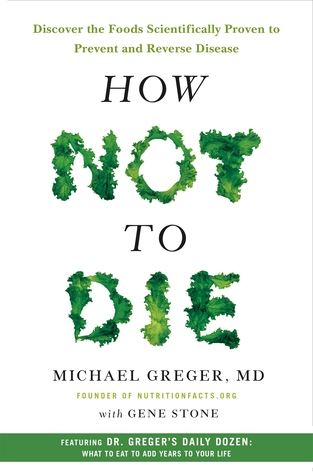

قالت العرب قديمًا: “المعدة بيت الداء"، وهذا بالضّبط ما يدور حوله مُحتوى كتاب How Not to Die: Discover the Foods Scientifically Proven to Prevent and Reverse Disease. كما أنه يدور على فكرة مرافقة لها وهي أن "المعدة تستطيع أن تكون سبب الدواء أيضًا" لو عرفت ما الذي تأكله وما الذي يجب عليك تجنّبه.

الكتاب مُفيد جدًا ومليء بالنصائح المدعومة بأبحاث علمية في مجملها. الخلاصة التي يريد أن يُقنعك الكاتب بها هي: “يجب أن تصبح نباتيًا vegan" رغم أنه "يزعم" بأنه لا يحاول إقناعك بأية حمية غذائية بعينها، وإنما يحاول إعطاءك النصائح والدلائل العلمية التي يمكنك أن تبني عليها خياراتك الغذائية. أجد الكتاب مُبالِغًا في العديد من الجوانب، خاصة دعوته إلى التخلص من كل ما هو حيواني المصدر، لكن الدعوة بشكل أقرب ما يكون من التصريح إلى التحول إلى نظام غذائي نباتي صرف vegan (يعني حتى الحليب والبيض يُصبحان من الممنوعات) فهذا أمر أعتبره تطرّفا، خاصة وأنه من الثابت علميًا أن مثل هذه الحمية الغذائية لا يُمكن لصاحبها أن يستغني عن بعض الفيتامينات الضرورية التي لن يجدها سوى في المصادر الحيوانية، وهو ما سيدفع بمن يتبع هذه الحمية إلى الاعتماد على المكملات الغذائية supplements وهي نفس المكملات التي بيّن الكتاب بأنها لا تُعطي نفس النتيجة لما تُستهلك كـ "حبوب" pills وليس كغذاء كامل. أمر آخر أعيبه على الكتاب هو اعتماده على دراسات تفتقد إلى المصداقية العلمية، فعلى سبيل المثال، بناء نصائح اعتمادًا على تجارب أجريت على عيّنة صغيرة جدًا (10 أشخاص أو 10 فئران مثلا) لا يُمكن لها بأي حال من الأحوال أن تكون دراسة صلبة أبني عليها قرارات تتعلّق بصحّتي وبمستقبلي.

هذا كان الجانب المُظلم لي في الكتاب، لكن الجانب المضيء منه قد ينسيك هذه النقائص. الكاتب يعود إلى جذور المشكل الأساسية، وكيف أن المشاكل الصحية العديدة التي نعاني منها في هذا العصر راجعة بشكل أساسي إلى جشع الرأس المالية (لم يُسميها الكاتب مباشرة، لكن لو تتبّعت الدلائل المنطقية إلى نهايتها فهذه هي النتيجة التي ستصل إليها). فمن جهة لا يحصل الأطباء في الجامعات على أي تكوين يُذكر فيما يتعلّق بالتغذية والأكل، بل يقتصر الأمر على معرفة الأعراض والأمراض ومُعالجتها. بعبارة أخرى، يتم تكوين الطبيب على إخماد الحريق بعد اندلاعه وبعد أن يُلحق أضرارًا بالغة، ولا يتم تكونيه على اكتشاف أسباب الحرائق ومنعها قبل حدوثها. فعلى سبيل المثال، أشار الكاتب إلى أن أكاديمية كاليفورنيا لطب الأسرة عارضت مشروع قانون يجبر جميع الأطباء على الخضوع لتكوين من 12 ساعة يتعلّق بالتغذية، ليبقى مجموع ما يحصل عليه كل طبيب/طالب طب هو 0 ساعة من التكوين في موضوع في غاية الأهمّيّة.

في المُقابل فإن الكثير من الأغذية معروف عنها قدرتها على الحماية من العديد من الأمراض، بل وحتى علاجها بشكل كامل، لكن بحكم أنه لا يُمكن الحصول على براءة اختراع "مشروع الزنجبيل مثلا" أو "طبق كبير من السلطة والخضروات" وبحكم أنه لا يمكن الاستفادة ماديًا (خاصة شركات الأدوية) من إخبارك بأن الطعام الصحّي كفيل بتجنيبك الكثير من الأمراض، فإن التركيز يتم على "إخماد النار" بدل "الحماية منها". أضف إلى ذلك أن شركات الغذاء العالمية تعمل وفق إطار عمل لا يتوافق بالضرورة مع ما يحفظ صحّتك، فما تحتاجه هذه الشركات هو تصنيع الغذاء وتعليبه وشحنه وبيعه بشكل يسهل عليها هذه المهام كلّها، وهو ما يتطلب عادة تصنيعًا وتكريرًا ومُعالجة يجعل من الغذاء الذي تأكله سمًا، لكنه سم لا يقتلك بسرعة، لكن ينخر في صحّتك ببطء.

لا يُمكن تلخيص الكتاب بشكل سريع، لكن إليك بعض ما ورد فيه من أفكار لتكوّن فكرة أفضل حوله (لتعرف إن كانت تُهمّك قراءته أو لا):

- تحتاج أن تجعل حميتك الغذائية مبنية على الكثير من الخضروات والفواكه والحشائش والحبوب (كاملة وليست معالجة) والمكسّرات والتوابل وتجنب/التقليل من المصادر الحيوانية قدر المستطاع والتخلص من جميع الأكل المُصنّع.

- أغلب الأمراض التي تُسبب موت الإنسان في العصر الحديث (أو على الأقل في الغرب) ترجع إلى خيارات شخصية بدرجة أولى. السرطانات على اختلاف أنواعها، السّكري وارتفاع ضغط الدمّ، العديد من أمراض الجهاز الهضمي، أمراض الكبد، الألزهايمر وحتى الاكتئاب، كلّها أمراض ترجع بشكل أساسي إلى خلل في النظام الغذائي، الرجوع إلى نظام غذائي يكون نباتيا بشكل كبير يساعد على الحد من تطوّر هذه الأمراض وفي حالات كثيرة، يساعد على الشفاء منها كلّيّة، وفي بعض الحالات في ظرف قياسي.

- على عكس ما كنت أتوقّعه، تُعتبر اللحوم البيضاء أسوأ من اللحوم الحمراء على أصعدة عديدة، خاصّة وأنه في بعض البلدان كالولايات المُتّحدة، يُعتبر حقن اللحوم البيضاء ببعض المحاليل لزيادة وزنها أمرا قانونيًا.

- في حالة إصابة بعض اللحوم ببعض البكتيريا التي يسهل التخلص منها بطهي اللحم بدرجات حرارة عالية، فهذا لا يعني بالضرورة التخلص من تلك البكتيريا بشكل كامل، بحكم أن الأسطح التي تلامس اللحم لدى تحضيره، عادة ما يُعاد لمسها من جديد أثناء وبعد طهي اللحم، مما يعني بإن الإصابة بتلك البكتيريا يبقى قائمًا.

- طريقة طهي الطعام (كيفية التحضير ودرجة الحرارة ونحو ذلك) لا تقلّ أهميّة عن محتوى الطعام في حد ذاته. لكن الأسوأ على الإطلاق هو "التدخين" خاصّة ما تعلّق الأمر باللحوم.

- يُعتبر الكركم أحد التوابل ذات المفعول السحري (خاصّة لما يتعلّق الأمر بالوقاية من سرطانات عديدة). احرص على أن يكون حاضرًا في حميتك الغذائية وداوم على استهلاكه.

- نفس الأمر مع نبتة البروكولي. لديها فوائد جمّة، احرص على استهلاكها بشكل يومي إن استطعت إلى ذلك سبيلًا. من الطرائف التي وجدتها في هذا الكتاب هو أن بعض الخصائص التي لا نجدها سوى في البروكولي وفي بعض النباتات التي تنتمي إلى نفس عائلته، لا نجدها سوى في مصدر آخر: “بول الإبل".

- كلما زادت قتامة لون الخضر أو الفواكه كلما زادت نسبت مضادات الأكسدة فيه وكلما زادت فائدتها.

- بعض الفواكه مثل التوت على مُختلف أنواعه berries تُعتبر من أفضل الأغذية التي يُمكنك تناولها نظرًا لكمية مضادات الأكسدة التي تحويها.

لدى قراءة هذا الكتاب، بقيت "القاعدة الذهبية" الخاصة بمايكل بولن Michael Pollan تدور في ذهني خلال كل هذه الفترة. القاعدة تقول:

"Eat food, not too much, mostly plants."

يعني "كل غذاءً، لا تأكل كثيرًا، اعتمد أكثر على النبات"

المقصود بـ "كل غذاءً" هو أن لا تأكل إلا ما يُمكن اعتباره غذاءً، أي كل ما لا يكون مُصنّعًا أو مكرّرا أو مُعالجا، ولتسهل الأمر على نفسك يجب أن يتجاوز الغذاء الذي تأكله بعض "الاختبارات" البسيطة:

- إن عرضت ما تنوي أكله على جدة جدّتك فإنها ستتعرف عليه على أنه أكل/غداء

- لا يحتوي على أكثر من 5 مكوّنات، ويُمكن النطق بأسماء جميع هذه المكونات

- لو تركت هذا الأمر خارج الثلاجة فإنه يفترض به أن يتعفّن (باستثناء العسل).

قد ينفّرك عنوان الكتاب من قراءة مُحتواه، خاصة إذا لم تقرأ العنوان الفرعي (الذي يُعتبر أكثر دقّة)، رغم ذلك فإن في آخر صفحات الكتاب اقتباسًا أجده في غاية الأهمية، وأعتقد أنه يجب أخذه بالحسبان خاصة لدى قراءة مثل هذا النوع من الكتب. الاقتباس هو جواب أحد الأطباء عن سبب اختياره لنظام أكل صحّي: لا أخشى الموت، فكلنا سنموت، لكن لا أريد أن يكون ذلك بسببي (أو بسبب خطأ ارتكبته كنت قادرا على تجنّبه). هذا الاقتباس ذكره الكاتب بعد أن سرد قصّة موت صديق له في سن مُبكّرة رغم أنه كان يتّبع حمية غذائية صارمة ويمارس الرياضة ويقوم بكل ما يتوجب عليه القيام به، لكنه مات باختناق أول أكسيد الكربون. يعني وكأن لسان حال الكاتب يقول "أنت مطالب باتخاذ الأسباب فقط".

الكتاب في غاية الأهمّية. كما أشرت، أجده متطرّفا قليلا فيما يخص التخلص من جميع ما هو حيواني، لكن يبدو بأن مثل هذا التطرّف قد يكون مفيدا في دفع الناس إلى اعتماد منهج وسط، منهج يقلل من المصادر الحيوانية كثيرًا ويعتمد بشكل أساسي على النبات.
